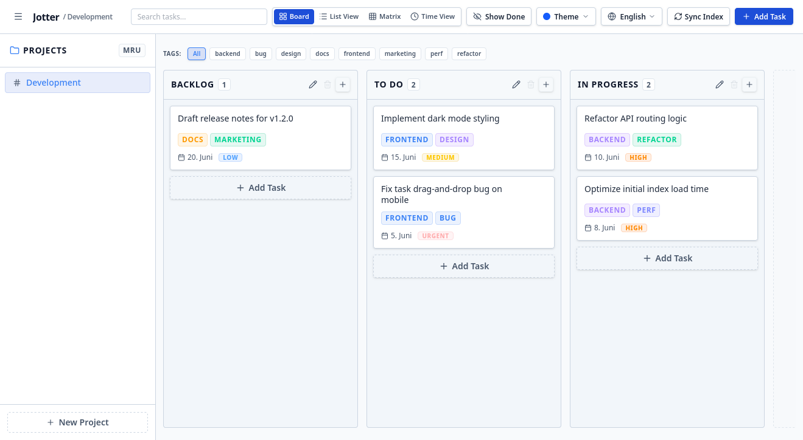

# Jotter

<p align="center">
  
  
  
  
  
  
  
</p>

🚀 **Try the Online Demo**: [simon123h.github.io/Jotter/demo/](https://simon123h.github.io/Jotter/demo/)

Jotter is a **local-first, privacy-focused task management web application** designed to help you organize tasks without losing data ownership. Modeled as a Markdown Kanban board, Jotter helps combat "task flooding" through filtering, intuitive UI, all while keeping your data stored locally in simple, plain-text files on your own machine. The integrated git support allows for syncing the tasks across devices.

**Documentation**: [simon123h.github.io/Jotter](https://simon123h.github.io/Jotter/)



---

## 🌟 Key Features

- **Data Ownership & Portability**: Tasks are stored as human-readable `.md` markdown files. Your data remains yours, fully accessible even if you stop using Jotter.
- **Combat Task Flooding**: Built for dealing with hundreds of open tasks.
- **Flexible Views**: Organise tasks your way with Kanban columns, list view, a priority-based **Eisenhower Matrix**, and a chronological **Time View** grouping by due dates.
- **Smart Task Creation**: Create rich tasks quickly with keywords for tags, due dates or priorities in the task title.
- **Offline-First & Local Index**: Runs entirely on your computer with a lightning-fast local SQLite database index. If the database index is ever deleted, the system automatically rebuilds it instantly from your markdown files.
- **Selective Per-Project Git Sync**: Enable synchronization for individual projects by connecting them to different Git remotes. Keep "Home" local while sharing "Work" with a team.
- **Git-Backed Time Machine**: Roll your workspace or individual projects back to any historical snapshot in your Git history using a dedicated, searchable, and spacious dialog. Automatically creates pre-restore backup commits so you can revert any rollback operation at any time.
- **Multi-Language Support**: Fully localized in English and German.
- **Model Context Protocol (MCP) Support**: Connect AI assistants directly to your local Kanban board via `jotter mcp`.
- **Excel & CSV Import & Export**: Seamlessly import tasks, checklists, priorities, and custom columns from any standard Excel or CSV spreadsheet with support for sheet auto-detection, interactive previews, and custom mappings. Export all tasks from your current filtered view as `.xlsx` or `.csv` client-side.

---

## 📦 Quick Start

### Option 1: Run directly with `pipx` (Recommended for Python users)

No cloning or Node.js required—just Python:

```bash
pipx run jotter-app
```

Or install globally in an isolated environment:
```bash
pipx install jotter-app
jotter
```

### Option 2: Standalone Executable (Zero Python Required)

Download the pre-compiled `jotter-server` executable from [GitHub Releases](https://github.com/simon123h/jotter/releases) for Windows, Linux, or macOS. No runtime or build tools needed.

### Option 3: Run from Source

1. Clone the repository:
   ```bash
   git clone https://github.com/simon123h/jotter.git
   cd jotter
   ```
2. Install dependencies:
   ```bash
   pip install -e .
   ```
3. Start the server:
   ```bash
   jotter
   # or: python3 run.py
   ```

Open your browser at **`http://localhost:58271`**.

Jotter automatically handles both portable and global configurations out of the box:

- **Portable Mode (Self-Contained)**: If a `tasks/` directory is present in the folder you execute Jotter from, tasks will default to `./tasks` and configurations to `./jotter.yaml` in that folder.
- **Global / Installed Mode**: Otherwise, Jotter uses standard OS-specific directories for both data and settings storage (such as XDG standard paths on Linux, AppData on Windows, and Application Support on macOS).
- **Auto-Config Generation**: If no configuration file exists at all on startup, Jotter will automatically create a default, annotated `jotter.yaml` template file for you at the default location.

For advanced customization and full directory details, please see [the user configuration documentation](docs/user/configuration.md).

---

## 🛠️ Development & Testing

```bash
# Install frontend and backend dependencies
npm run install:all

# Run backend and frontend dev servers concurrently
npm run dev

# Run all test suites (Pytest + Vitest)
npm run test

# Run frontend E2E browser tests (Playwright)
cd frontend && npx playwright test
```

---

## 📖 Documentation

The complete documentation is available at **[simon123h.github.io/Jotter/](https://simon123h.github.io/Jotter/)**.

Alternatively, you can refer to the raw Markdown source files in the `docs/` folder:

- **User Guide & Setup**:
  - [Configuring Jotter (Ports, Directories, Logs)](docs/user/configuration.md)
  - [Search & Filtering DSL](docs/user/searching-filtering.md)
  - [Importing & Exporting Data (Excel & CSV)](docs/user/import-export.md)
  - [Keyboard Shortcuts](docs/user/shortcuts.md)
  - [Postponing Tasks](docs/user/postponing.md)
  - [Markdown File Format Specification](docs/user/format-spec.md)
  - [Obsidian & PKM Sync](docs/user/obsidian.md)
  - [Git Sync & Collaboration](docs/user/git-sync.md)
  - [Data Safety & Recovery](docs/user/safety.md)
- **Developer Reference**:
  - [Architectural Design (arc42)](docs/developer/architecture.md)
  - [API Documentation (Interactive OpenAPI/Swagger)](http://localhost:58271/docs) _(Available when running the server)_
  - [Contributing Guidelines](CONTRIBUTING.md)
