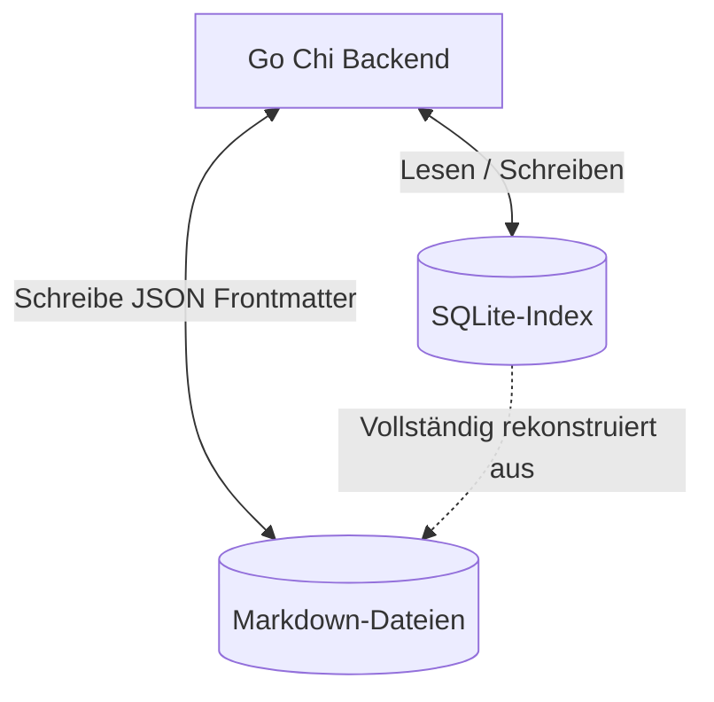
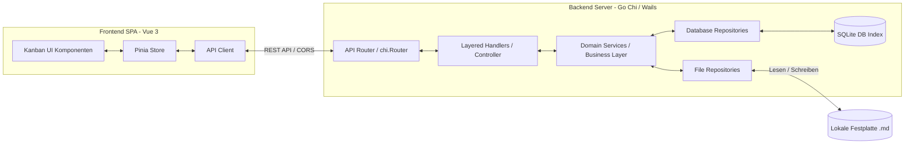
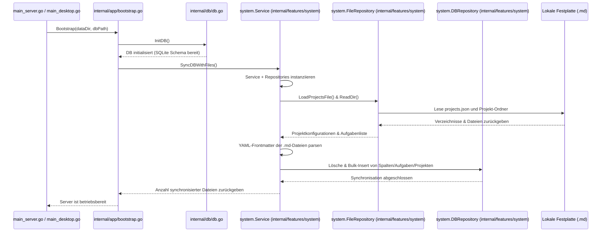

# Systemarchitektur: Jotter (arc42)

Dieses Dokument beschreibt die Architektur von **Jotter** anhand des standardisierten **arc42-Templates**.

---

## 1. Einführung und Ziele

Jotter is eine lokale (Local-First), nicht-kommerzielle Projektmanagement-Software. Sie dient als freie Alternative zu Cloud-basierten Kanban-Boards wie Trello oder MS Planner.

### 1.1 Anforderungsübersicht

* **Anti-Aufgabenflut**: Aggressives Filtern von Aufgaben (z. B. Ausblenden der "Erledigt"-Spalte), um einer visuellen Überforderung entgegenzuwirken.
* **Dateibasierte Portabilität**: Speicherung in menschenlesbaren Markdown-Dateien als primäres Dateiformat, damit Aufgaben auch außerhalb der App nutzbar bleiben.
* **Geschwindigkeit**: Verzögerungsfreie Drag-and-Drop-Operationen, Filterungen und Suchvorgänge.

### 1.2 Qualitätsziele

1. **Datensouveränität & Compliance**: Keine Cloud-Synchronisation, rein lokales Arbeiten auf eigenen Speichermedien.
2. **Robustheit**: Der Zustand der indizierten SQLite-Datenbank muss jederzeit vollständig und fehlerfrei aus den Markdown-Dateien rekonstruiert werden können.
3. **Minimale Latenz**: Jede Interaktion in der Benutzeroberfläche muss sich extrem schnell und flüssig anfühlen, selbst bei über 1000 Aufgaben.

---

## 2. Randbedingungen

* **Plattformunabhängigkeit**: Vorkompilierte ausführbare Binärdateien müssen für Linux, macOS und Windows zur Verfügung gestellt werden.
* **Offline-First**: Die Anwendung muss ohne jegliche Internetverbindung lokal lauffähig sein.
* **Keine Abhängigkeiten beim Start**: Vorkompilierte Einzeldateien müssen ohne vorinstallierte Python- oder Node-Laufzeitumgebungen auf dem Host-System lauffähig sein.

---

## 3. Kontextabgrenzung


* **Benutzer**: Interagiert über einen modernen Webbrowser mit Jotter.
* **Jotter-App**: Liefert das Frontend-Paket aus und stellt eine lokale REST-API bereit.
* **Lokales Dateisystem**: Enthält die Aufgaben des Benutzers, die als `.md`-Dateien in einer strukturierten Ordnerstruktur organisiert sind.

---

## 4. Lösungsstrategie

Jotter nutzt das **"Ephemeral Index" Entwurfsmuster** (flüchtiger Index), um die Vorteile einer relationalen Datenbank (schnelle Suchen, Sortierungen und Verknüpfungen) mit der Langlebigkeit von einfachen Textdateien zu kombinieren:



* **Einzige Quelle der Wahrheit (Single Source of Truth, SSoT)**: Die Markdown-Dateien (`.md`). Aufgabetitel, Spalte, Position, Tags und Fälligkeitsdatum werden im YAML-Frontmatter der Datei gespeichert, während Beschreibungen und Notizen im Markdown-Textkörper liegen.
* **Der Index-Dienst**: Eine flüchtige SQLite-Datenbank. Beim Start scannt und analysiert das Backend die Markdown-Dateien und baut eine relationale Tabelle für schnelle API-Zugriffe auf.
* **Auto-Rekonstruktion**: Wenn die SQLite-Datenbank gelöscht oder beschädigt wird, baut das System sie beim nächsten Start automatisch wieder aus den Textdateien auf.

---

## 5. Bausteinsicht



### 5.1 Frontend (Vue 3 Single Page Application)

* **Kanban UI-Komponenten**: Vue-Komponenten (`BoardView.vue`, `TaskCard.vue`), gestaltet mit Tailwind CSS.
* **Pinia Store**: Verwaltet clientseitige Einstellungen (wie lokale Präferenzen und Ansichten), die mit dem `localStorage` des Browsers synchronisiert werden.
* **API Client**: Kommuniziert mit den Routen des Backends.

### 5.2 Backend (Go Chi / Wails)

Jotter verwendet eine klare, mehrschichtige Architektur, die in modulare Feature-Pakete unterteilt ist (`internal/features/...`): `project`, `bucket`, `task`, `settings` und `system`. Jedes Paket folgt einer strikten Trennung in drei Schichten (äquivalent zu Controllers, Services und Repositories in Spring Boot):

1. **Handlers (Controller-Schicht)**:
   - Registriert feature-spezifische REST-Endpunkte (`RegisterRoutes`).
   - Fungiert als Einstiegspunkt für HTTP-Anfragen.
   - Analysiert Anfrageparameter und dekodiert Payloads in Go-Structs (DTOs - Data Transfer Objects).
   - Übersetzt domänenspezifische Rückgaben oder Fehler in HTTP-Statuscodes und JSON-Antworten.
2. **Services (Business-Logik / Domänenschicht)**:
   - Enthält die reine Geschäftslogik, Eingabevalidierungen und Regelprüfungen.
   - Koordiniert Repository-übergreifende Operationen (z. B. das synchrone Halten von Festplattendateien und dem SQLite-Index).
   - Steuert erweiterte Dateisystemoperationen wie Multipart-Dateianhänge, Aufgabenlisten-Filterungen und automatische Aufbewahrungsfristen.
3. **Repositories (Datenzugriffsschicht / Persistenz)**:
   - **Database Repository (SQLite Repositories)**: Kommuniziert über strukturierte SQL-Abfragen direkt mit dem lokalen SQLite-Index (`modernc.org/sqlite`).
   - **File Repository (Disk Repositories)**: Interagiert direkt mit dem Dateisystem des Host-Rechners, um Markdown-Dateien, Konfigurationsdateien (`projects.json`) und Dateianhänge zu schreiben und zu lesen.

---

## 6. Laufzeitsicht

### 6.1 Server-Start und Initialisierung

Beim Starten durchläuft Jotter eine Synchronisationsphase, um den Datenbank-Index exakt an die lokalen Dateien anzugleichen:



---

## 7. Verteilungssicht

Jotter wird in zwei unterschiedliche Binärdateien verpackt:

1. **`jotter-desktop` (GUI)**: Eine vollständige Desktop-Anwendung, verpackt mit **Wails**. Sie öffnet ein natives Webview-Fenster und führt das eingebettete Frontend aus.
2. **`jotter-server` (Server)**: Ein leichtgewichtiges CLI-Binary, das einen standardmäßigen HTTP-Server startet und das Frontend für jeden modernen Webbrowser im lokalen Netzwerk bereitstellt.

### Gemeinsame Merkmale:

* **Asset-Einbettung**: Das fertig gebaute Frontend-SPA-Paket (`dist/`) wird mittels `go:embed` direkt in das Go-Binary einkompiliert und nativ ausgeliefert.
* **Innere Logik**: Beide Distributionen teilen sich exakt denselben Go-Code aus den `internal/` Paketen, was ein absolut identisches Verhalten garantiert.

---

## 8. Git-Synchronisations-Logik

Jotter behandelt jedes Projektverzeichnis als potenzielles eigenständiges Git-Repository. Die Logik ist in `internal/features/common/git.go` implementiert und wird sequentiell für alle konfigurierten Projekte während einer Synchronisation ausgeführt.

### Der Ablauf pro Projekt:

1. **Erkennung**: Das Backend fragt die Datenbank nach allen Projekten mit eingerichteter `git_remote` URL ab.
2. **Auto-Setup**: Für jedes Projekt wird geprüft, ob ein `.git` Ordner existiert. Falls nicht, werden automatisch `git init` and `git remote add origin` ausgeführt.
3. **Commit**: Führt `git add .` und `git commit` im jeweiligen Projekt-Unterverzeichnis aus.
4. **Fetch & Merge**: Holt Änderungen vom `origin` ab und versucht einen sicheren Merge (`git pull --rebase`).
5. **Konflikt-Isolation**: Konflikte werden pro Projekt isoliert behandelt. Hat Projekt A einen Konflikt, wird dessen Merge abgebrochen, während Projekt B dennoch fehlerfrei synchronisiert wird.
6. **Push**: Erfolgreiche Zusammenführungen werden an das jeweilige Remote-Repository hochgeladen.

Diese Architektur ermöglicht ein **selektives Teilen**, bei dem unterschiedliche Boards mit verschiedenen Teams geteilt oder auch komplett lokal gehalten werden können.

---

## 9. Datenmodell

### 9.1 Markdown YAML Frontmatter

Jede Aufgabendatei wird nach dem Muster `[id]-[title-slug].md` benannt. Die Metadaten werden im YAML-Frontmatter serialisiert:

```yaml
---
id: 1042
project_id: default
title: Authentifizierung reparieren
bucket: todo
position: 2000.0
tags:
  - backend
  - auth
due_date: 2026-06-30
priority: high
created_at: 2026-06-04T12:00:00Z
---
Hier folgen die Inhaltsbeschreibungen der Aufgabe in Standard-Markdown.
```

---

## 10. API & Swagger-Dokumentation

Jotter verfügt über eine vollautomatische OpenAPI 2.0 (Swagger) Spezifikationsgenerierung.

* **OpenAPI-Annotationen**: Jeder Handler/Controller im Go-Backend ist vollständig mit Attributen wie `@Summary`, `@Description`, `@Tags`, `@Accept`, `@Produce`, `@Param`, `@Success`, `@Failure` und `@Router` versehen.
* **Swagger-UI-Endpunkt**: Bei Ausführung von `jotter-server` ist das Swagger-UI standardmäßig unter `http://localhost:58271/swagger/index.html` erreichbar.
* **Spezifikation aktualisieren**: Nach Änderungen an den Go-Handlern kann die Dokumentation über folgendes npm-Skript regeneriert werden:
  ```bash
  npm run swagger:generate
  ```
  Dies ruft den `swag` CLI-Generator auf, analysiert die Kommentare im Go-Quellcode und aktualisiert die JSON- und YAML-Dateien im Verzeichnis `internal/docs/`.
