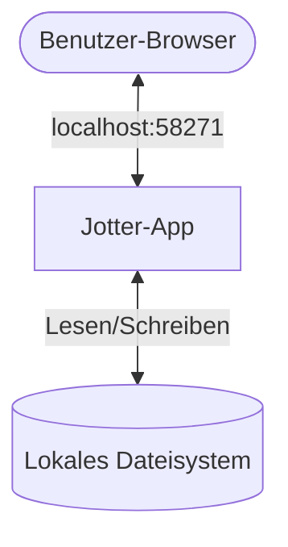
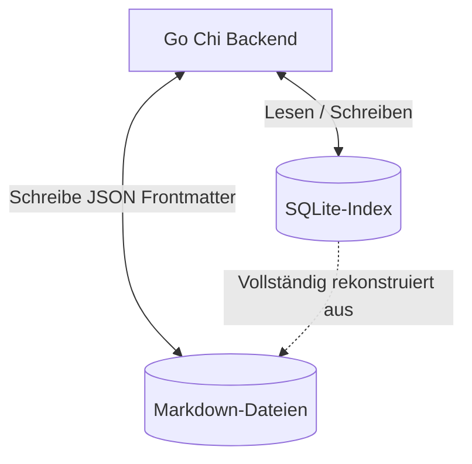
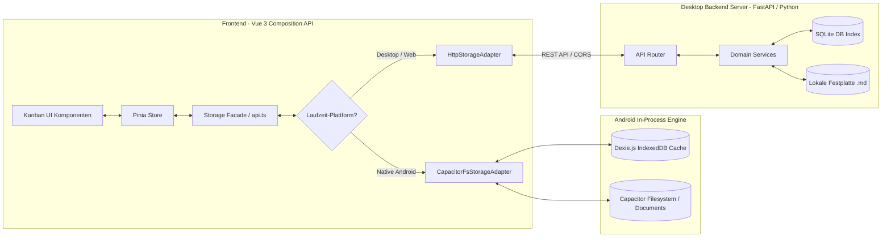
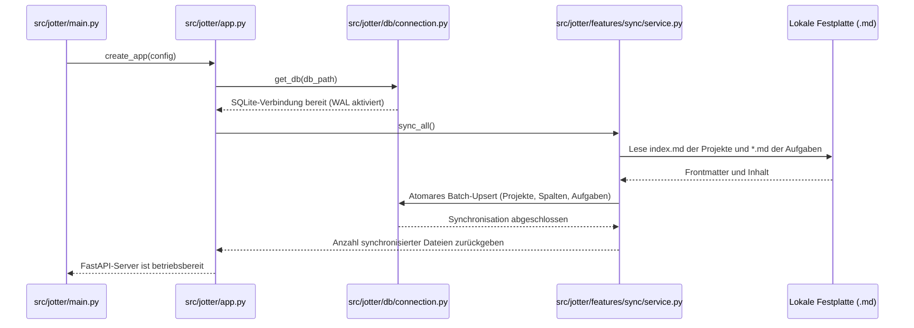

# Systemarchitektur: Jotter (arc42)

Dieses Dokument beschreibt die Architektur von **Jotter** anhand des standardisierten **arc42-Templates**.

---

## 1. Einführung und Ziele

Jotter is eine lokale (Local-First), nicht-kommerzielle Projektmanagement-Software. Sie dient als freie Alternative zu Cloud-basierten Kanban-Boards wie Trello oder MS Planner.

### 1.1 Anforderungsübersicht

* **Anti-Aufgabenflut**: Aggressives Filtern von Aufgaben (z. B. Ausblenden der "Erledigt"-Spalte), um einer visuellen Überforderung entgegenzuwirken.
* **Dateibasierte Portabilität**: Speicherung in menschenlesbaren Markdown-Dateien als primäres Dateiformat, damit Aufgaben auch außerhalb der App nutzbar bleiben.
* **Geschwindigkeit**: Verzögerungsfreie Drag-and-Drop-Operationen, Filterungen und Suchvorgänge.

### 1.2 Qualitätsziele

1. **Datensouveränität & Compliance**: Keine Cloud-Synchronisation, rein lokales Arbeiten auf eigenen Speichermedien.
2. **Robustheit**: Der Zustand der indizierten SQLite-Datenbank muss jederzeit vollständig und fehlerfrei aus den Markdown-Dateien rekonstruiert werden können.
3. **Minimale Latenz**: Jede Interaktion in der Benutzeroberfläche muss sich extrem schnell und flüssig anfühlen, selbst bei über 1000 Aufgaben.

---

## 2. Randbedingungen

* **Plattformunabhängigkeit**: Vorkompilierte ausführbare Binärdateien müssen für Linux, macOS und Windows zur Verfügung gestellt werden.
* **Offline-First**: Die Anwendung muss ohne jegliche Internetverbindung lokal lauffähig sein.
* **Keine Abhängigkeiten beim Start**: Vorkompilierte Einzeldateien müssen ohne vorinstallierte Python- oder Node-Laufzeitumgebungen auf dem Host-System lauffähig sein.

---

## 3. Kontextabgrenzung



* **Benutzer**: Interagiert über einen modernen Webbrowser mit Jotter.
* **Jotter-App**: Liefert das Frontend-Paket aus und stellt eine lokale REST-API bereit.
* **Lokales Dateisystem**: Enthält die Aufgaben des Benutzers, die als `.md`-Dateien in einer strukturierten Ordnerstruktur organisiert sind.

---

## 4. Lösungsstrategie

Jotter nutzt das **"Ephemeral Index" Entwurfsmuster** (flüchtiger Index), um die Vorteile einer relationalen Datenbank (schnelle Suchen, Sortierungen und Verknüpfungen) mit der Langlebigkeit von einfachen Textdateien zu kombinieren:



* **Einzige Quelle der Wahrheit (Single Source of Truth, SSoT)**: Die Markdown-Dateien (`.md`). Aufgabetitel, Spalte, Position, Tags und Fälligkeitsdatum werden im YAML-Frontmatter der Datei gespeichert, während Beschreibungen und Notizen im Markdown-Textkörper liegen.
* **Der Index-Dienst**: Eine flüchtige SQLite-Datenbank. Beim Start scannt und analysiert das Backend die Markdown-Dateien und baut eine relationale Tabelle für schnelle API-Zugriffe auf.
* **Auto-Rekonstruktion**: Wenn die SQLite-Datenbank gelöscht oder beschädigt wird, baut das System sie beim nächsten Start automatisch wieder aus den Textdateien auf.

---

## 5. Bausteinsicht



### 5.1 Frontend (Vue 3 Single Page Application & Mobile App)

* **Kanban UI-Komponenten**: Vue 3 Composition API Komponenten (`<script setup lang="ts">`), gestaltet mit Tailwind CSS, mobiler Navigationsleiste und haptischem Feedback.
* **Pinia Store**: Verwaltet clientseitige Einstellungen, aktives Projekt, Filter und Pomodoro-Zustände.
* **Storage-Schicht Abstraktion (`StorageAdapter`)**:
  * `HttpStorageAdapter`: Kommuniziert über REST-API mit dem Python-Backend auf Desktop/Web.
  * `CapacitorFsStorageAdapter`: Vollwertige In-Process TypeScript-Engine für Android. Liest und schreibt echte `.md`-Markdown-Dateien im Android-Dateisystem und verwaltet einen lokalen IndexedDB-Index per Dexie.js.

### 5.2 Backend (FastAPI Python-Anwendung)

Jotter verwendet eine klare, mehrschichtige Architektur, die in modulare Feature-Pakete unterteilt ist (`src/jotter/features/...`): `projects`, `buckets`, `tasks`, `settings` und `sync`. Jedes Paket folgt einer strikten Trennung der Schichten:

1. **Routes (Controller-Schicht)**:
   - Registriert feature-spezifische REST-Endpunkte (`projects/router.py`, `buckets/router.py`, `tasks/router.py`, `settings/router.py`, `system/router.py`).
   - Fungiert als Einstiegspunkt für HTTP-Anfragen.
   - Analysiert Anfrageparameter und validiert Payloads in Pydantic-Modelle (DTOs - Data Transfer Objects).
   - Übersetzt domänenspezifische Rückgaben oder Fehler in HTTP-Statuscodes und JSON-Antworten.
2. **Services (Business-Logik / Domänenschicht)**:
   - Enthält die reine Geschäftslogik, Eingabevalidierungen und Regelprüfungen.
   - Koordiniert Repository-übergreifende Operationen (z. B. das synchrone Halten von Festplattendateien und dem SQLite-Index).
   - Steuert erweiterte Dateisystemoperationen wie Multipart-Dateianhänge, Aufgabenlisten-Filterungen und automatische Aufbewahrungsfristen.
3. **Repositories (Datenzugriffsschicht / Persistenz)**:
   - **Database Repository (SQLite Repositories)**: Kommuniziert über strukturierte SQL-Abfragen direkt mit dem lokalen SQLite-Index (`tasks.db`) mit aktiviertem WAL-Modus.
   - **File Repository (Disk Repositories)**: Interagiert direkt mit dem Dateisystem des Host-Rechners, um Markdown-Dateien nach dem Open Knowledge Format (OKF) und Obsidian Folder Notes (`<project_id>/index.md` Projekt-Manifeste und `<project_id>/tasks/<id>.md` Aufgabendateien), Konfigurationsdateien (`jotter.yaml`, `settings.json`) und Dateianhänge zu schreiben und zu lesen.

---

## 6. Laufzeitsicht

### 6.1 Server-Start und Initialisierung

Beim Starten durchläuft Jotter eine Synchronisationsphase, um den Datenbank-Index exakt an die lokalen Dateien anzugleichen:



---

## 7. Verteilungssicht

Jotter wird als leichtgewichtige Webanwendung bereitgestellt:

1. **Backend**: Python 3 (FastAPI + Uvicorn) zur Bereitstellung der REST-Endpunkte und statischen Dateien.
2. **Frontend**: Gebaute Single Page Application (Vue 3 + Vite + Tailwind CSS), direkt ausgeliefert über `frontend/dist/`.

Ausführen von Jotter:
```bash
pip install -e .
jotter
```

---

## 8. Git-Synchronisations-Logik

Jotter behandelt jedes Projektverzeichnis als potenzielles eigenständiges Git-Repository. Die Logik ist in `src/jotter/features/git/service.py` implementiert und wird sequentiell für alle konfigurierten Projekte während einer Synchronisation ausgeführt.

### Der Ablauf pro Projekt:

1. **Erkennung**: Das Backend fragt die Datenbank nach allen Projekten mit eingerichteter `git_remote` URL ab.
2. **Auto-Setup**: Für jedes Projekt wird geprüft, ob ein `.git` Ordner existiert. Falls nicht, werden automatisch `git init` and `git remote add origin` ausgeführt.
3. **Commit**: Führt `git add .` und `git commit` im jeweiligen Projekt-Unterverzeichnis aus.
4. **Fetch & Merge**: Holt Änderungen vom `origin` ab und versucht einen sicheren Merge.
5. **Konflikt-Isolation**: Konflikte werden pro Projekt isoliert behandelt. Hat Projekt A einen Konflikt, wird dessen Merge abgebrochen, während Projekt B dennoch fehlerfrei synchronisiert wird.
6. **Push**: Erfolgreiche Zusammenführungen werden an das jeweilige Remote-Repository hochgeladen.

Diese Architektur ermöglicht ein **selektives Teilen**, bei dem unterschiedliche Boards mit verschiedenen Teams geteilt oder auch komplett lokal gehalten werden können.

---

## 9. Datenmodell

### 9.1 Aufgaben-Frontmatter (Open Knowledge Format)

Jede Aufgabendatei wird nach ihrer ID benannt (`<id>.md`). Die Metadaten werden im YAML-Frontmatter serialisiert:

```yaml
---
type: task
id: 01HJKM7ST89AB234CDEFGHJKMN
project_id: default
title: Authentifizierung reparieren
status: todo
position: 2000.0
tags:
  - backend
  - auth
due_date: "2026-06-30"
priority: high
created_at: "2026-06-04T12:00:00Z"
updated_at: "2026-06-04T12:00:00Z"
---
Hier folgen die Inhaltsbeschreibungen der Aufgabe in Standard-Markdown.
```

### 9.2 Projekt-Manifest (`index.md`)

Jeder Projektordner enthält eine `index.md`-Notiz, die Board-Spalten und Projekt-Metadaten definiert:

```yaml
---
type: project
id: default
title: Hauptprojekt-Board
git_remote: "https://github.com/user/my-tasks.git"
done_clean_period: "after_1_week"
buckets:
  - name: todo
    title: Zu erledigen
    position: 1000.0
    is_done: false
    collapsed: false
  - name: in-progress
    title: In Bearbeitung
    position: 2000.0
    is_done: false
    collapsed: false
  - name: done
    title: Erledigt
    position: 3000.0
    is_done: true
    collapsed: false
---
Notizen, Projektübersicht und Dokumentation.
```

---

## 10. API & OpenAPI-Dokumentation

Jotter verfügt über eine vollautomatische OpenAPI 3.0 Spezifikationsgenerierung via FastAPI.

* **Interaktive API-Dokumentation**: Bei laufendem Jotter-Server ist die interaktive Dokumentation unter `http://localhost:58271/docs` (Swagger UI) sowie `http://localhost:58271/redoc` (ReDoc) erreichbar.
