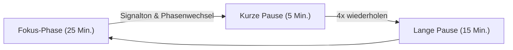

# Pomodoro Fokus-Timer

Der **Pomodoro-Timer** in Jotter bietet eine schwebende Fokusleiste, mit der du konzentrierte Arbeitsphasen und erholsame Pausen direkt in deiner Arbeitsumgebung einhalten kannst.

---

## Übersicht

Die Pomodoro-Methode wechselt fokussierte Arbeitsintervalle mit kurzen Pausen ab:

---

## Hauptfunktionen

### 1. Schwebende Steuerungsleiste
* **Jederzeit aufrufbar**: Klicke auf das 🍅 Tomaten-Symbol in der oberen Navigationsleiste, um den Pomodoro-Timer ein- oder auszublenden.
* **Unterbrechungsfreier Hintergrundlauf**: Der Timer läuft beim Wechseln zwischen Kanban-, Listen-, Matrix- und Triage-Ansichten weiter.
* **Browser-Tab-Anzeige**: Der Tab-Titel zeigt den aktuellen Countdown an (z. B. `(24:15) 🍅 Jotter`).

### 2. Aufgabenverknüpfung
* **1-Klick Fokus**: Fahre mit der Maus über eine Aufgabenkarte und klicke auf das Timer-Symbol, um die Aufgabe an die Pomodoro-Leiste zu binden.
* **Fokus-Markierung**: Die aktive Aufgabe wird mit einem dezenten 🍅 Badge hervorgehoben.
* **Lösen jederzeit möglich**: Über das <kbd>×</kbd>-Symbol in der Leiste lässt sich die Verknüpfung wieder aufheben.

### 3. Audio-Benachrichtigung
* **Harmonischer Signalton**: Integrierter Web-Audio-Klang informiert zuverlässig über das Ende jeder Phase – ohne externe Audiodateien und komplett offlinefähig.
* **Ein-/Ausschaltbar**: Sound kann direkt im Einstellungen-Popover umgeschaltet werden.

### 4. Individuelle Zeiten
Über das ⚙️ Zahnrad-Symbol in der Pomodoro-Leiste lassen sich Zeiten flexibel anpassen:
* **Fokus-Dauer**: Standard 25 Minuten (1–120 Min.).
* **Kurze Pause**: Standard 5 Minuten (1–60 Min.).
* **Lange Pause**: Standard 15 Minuten (1–90 Min.).
* **Tonsignal**: Sound-Umschalter.

### 5. Tastenkürzel
* <kbd>Leertaste</kbd>: Timer starten / anhalten.
* <kbd>Esc</kbd>: Einstellungen schließen / Leiste minimieren.
