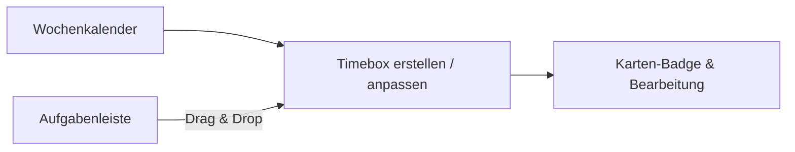

# Time Boxing (Fokusblöcke)

Die **Time Boxing**-Ansicht bietet einen interaktiven Wochenkalender, mit dem du Fokuszeiten planen und Aufgaben gezielt auf Zeitfenster verteilen kannst – ohne Ablenkungen oder Überfrachtung externer Kalender.

---

## Konzept & Funktionsweise

Time Boxing trennt **Zeitfenster (Boxen)** sauber von **Aufgaben**:
* Eine **Timebox** ist ein bewusster Fokusblock (z. B. *09:00–11:30 Deep Work: Auth-API*, *14:00–15:00 Code-Reviews*).
* **Aufgaben** werden per Drag & Drop in diese Boxen einsortiert.
* Es ist keine zeitraubende Pflege von Einzelaufgabendauern erforderlich: Mehrere kleinere Aufgaben können in einer gemeinsamen Box gebündelt oder eine einzelne Kernaufgabe in einen großen Block gelegt werden.

---

## Funktionen im Überblick

### 1. Interaktiver Wochenkalender
* **Arbeitswoche vs. Volle Woche**: Wechsel nahtlos zwischen 5 Tagen (<kbd>Mo–Fr</kbd>) und 7 Tagen (<kbd>Mo–So</kbd>).
* **Anpassbare Arbeitszeiten**: Standardbereich von `08:00 – 18:00` Uhr (in den Einstellungen anpassbar).
* **Echtzeit-Zeitanzeige**: Eine rote Markierung zeigt die aktuelle Uhrzeit im Tagesverlauf an.

### 2. Timeboxen erstellen & bearbeiten
* **Klick in Kalenderslot**: Klicke auf ein freies Stundenfeld, um sofort eine Timebox für diesen Tag und diese Stunde anzulegen.
* **Toolbar-Button**: Klicke oben rechts auf **Neue Timebox**.
* **Farbkodierung**: Wähle aus verschiedenen Akzentfarben (Indigo, Blau, Smaragd, Bernstein, Rose, Violett, Petrol, Schiefer).

### 3. Aufgaben per Drag & Drop zuordnen
* Öffne die **Aufgabenleiste** auf der rechten Seite.
* Filtere nach dem aktiven Projekt, nach „Heute geplant“ oder über das Suchfeld.
* Ziehe Aufgabenkarten direkt in eine Timebox im Kalender.
* Aufgaben können jederzeit über das <kbd>×</kbd>-Symbol wieder aus der Timebox entfernt werden.

### 4. Status und Badges auf Kanban-Karten
* Zugeordnete Aufgaben zeigen auf der Board-Karte ein dezentes Badge: `[📦 Mo 09:00 Deep Work]`.
* Erledigte Aufgaben in einer Timebox werden automatisch abgehakt und durchgestrichen dargestellt.

---

## Einstellungen

Unter **Einstellungen → Time Boxing** kannst du festlegen:
* **Standard-Wochenansicht**: Arbeitswoche (5 Tage) oder Volle Woche (7 Tage).
* **Kalender-Startuhrzeit**: Früheste sichtbare Stunde im Raster (z. B. `8`).
* **Kalender-Enduhrzeit**: Späteste sichtbare Stunde im Raster (z. B. `18`).
