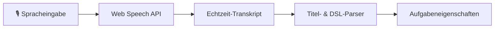

# Sprachdiktat (Speech-to-Text)

Jotter unterstützt natives Sprachdiktat für die schnelle, freihändige Erstellung und Bearbeitung von Aufgaben und Notizen. Über die standardmäßige **Web Speech API** des Browsers funktioniert das Diktat direkt auf Ihrem Gerät ohne externe Cloud-Dienste und ohne Latenz.

---

## Funktionsweise

Beim Diktieren von Aufgabentiteln oder Notizen wird die Sprache in Echtzeit transkribiert. Da Jotter über einen integrierten Natural-Language-Parser verfügt, werden gesprochene Schlüsselwörter (Fälligkeiten, Prioritäten, Tags, Spalten) sofort erkannt und als Aufgabeneigenschaften übernommen.

---

## Aufgabentitel diktieren

1. Öffnen Sie das **Modal zur Aufgabenerstellung** (<kbd>q</kbd>) oder klicken Sie im **Aufgabendetail-Modal** auf den Titel.
2. Klicken Sie auf das **Mikrofon-Symbol** auf der rechten Seite des Titeleingabefelds oder drücken Sie <kbd>Alt</kbd> + <kbd>D</kbd>.
3. Sprechen Sie Ihren Aufgabentitel und optionale Attribute ein.

### Beispiele für gesprochene Spracheingaben

| Gesprochener Text | Extrahierter Titel | Extrahierte Metadaten |
| :--- | :--- | :--- |
| *"Auth-Endpunkt refaktorisieren !urgent #backend @morgen"* | `Auth-Endpunkt refaktorisieren` | Priorität: `urgent` Tag: `backend` Fälligkeit: Morgen |
| *"Wöchentliches Team-Sync in:todo #meeting @freitag"* | `Wöchentliches Team-Sync` | Spalte: `todo` Tag: `meeting` Fälligkeit: Freitag |
| *"Speicherleck beheben !high #bug"* | `Speicherleck beheben` | Priorität: `high` Tag: `bug` |

> [!TIP]
> Sie können das Mikrofon-Symbol oder <kbd>Alt</kbd> + <kbd>D</kbd> jederzeit erneut betätigen, um die Aufnahme zu beenden.

---

## Notizen & Checklisten diktieren

Im Markdown-Editor der Aufgabendetails steht ein eigener Diktier-Button in der oberen rechten Ecke zur Verfügung:

1. Klicken Sie auf das **Mikrofon-Symbol** im Editor.
2. Sprechen Sie Ihre Notizen, Aufzählungspunkte oder Checklisten-Einträge.
3. Der transkribierte Text wird automatisch am Ende der Notizen angefügt.

---

## Browser-Unterstützung & Berechtigungen

Das Sprachdiktat basiert auf nativen Browser-APIs:

* **Unterstützte Browser**: Google Chrome, Microsoft Edge, Brave, Safari sowie Chromium-basierte mobile Browser.
* **Berechtigungen**: Der Browser fordert bei der ersten Nutzung Mikrofon-Zugriff an.
* **Sprachunterstützung**: Das Diktat passt sich automatisch der in Jotter ausgewählten Sprache an (Deutsch `de-DE` oder Englisch `en-US`).

---

## Tastaturkurzbefehle

| Tastenkombination | Aktion | Beschreibung |
| :--- | :--- | :--- |
| <kbd>Alt</kbd> + <kbd>D</kbd> | **Diktat umschalten** | Startet oder stoppt die Sprachaufnahme bei fokussiertem Titeleingabefeld. |
