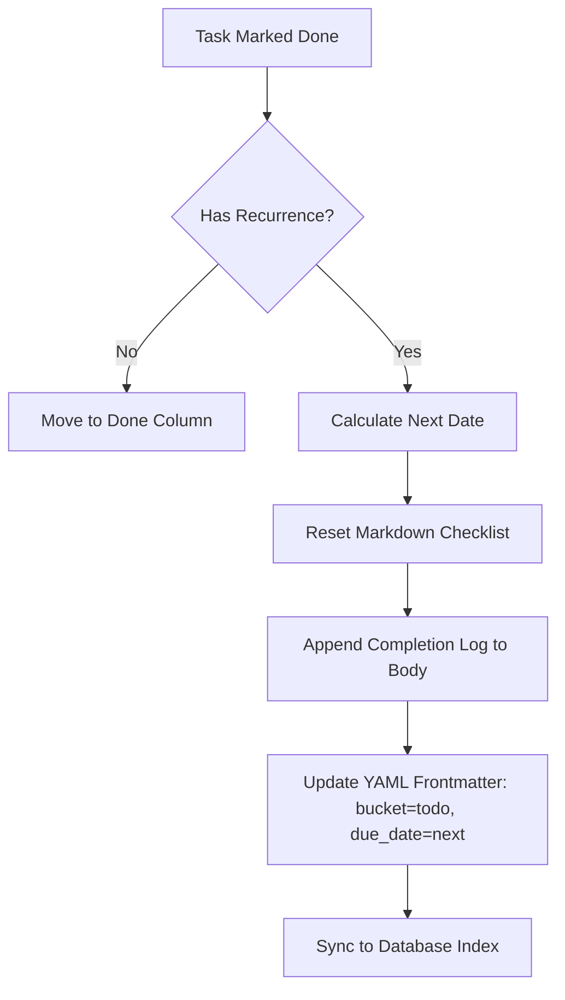

# ADR 2: Postponed Implementation of Recurrent Tasks

- **Status**: Rejected (Declined for Implementation)
- **Date**: 2026-07-08
- **Author**: Antigravity (AI Coding Assistant) & User

## Context

In addition to simple task postponement, we evaluated extending Jotter to support **Recurrent/Repeating Tasks** (tasks that automatically reappear after completion or at fixed dates).

We analyzed three trigger modes for recurrence:

1. **Sliding Interval (Completion-Relative)**: Reappear $N$ days/weeks/months after the task was marked "done".
2. **Fixed Interval (Sharp Schedule)**: Reappear $N$ days/weeks/months on a fixed grid (e.g., every Monday, or every 7 days sharp from original due date), regardless of when the task was completed.
3. **Specific Days-of-Week**: Reappear on specific days (e.g., every Monday and Wednesday).

We also evaluated two filesystem persistence models for a local-first plain-markdown system:

- **Option A (Inline Reset)**: Recycle the existing Markdown file by clearing its `done` status, resetting subtask checklist brackets (`[x]` to `[ ]`), moving it back to its original bucket (e.g. `todo`), and advancing its `due_date`/`postponed_until` to the next occurrence.
- **Option B (Clone & Spawn)**: Keep the completed task on disk, and create a brand new Markdown file copy with the updated date.

## Decision

We decided **not to implement** the recurrent tasks feature at this time.

The implementation was declined because:

1. **High Implementation Complexity**: Intercepting the task completion hooks (both single task changes and bulk done changes), parsing custom recurrence rules, calculating leap years/months/days in Go, resetting checklist syntax on disk, and building complex recurrence UI selectors introduces substantial complexity.
2. **Weak Current Need**: The user-validated need for recurring tasks is not strong enough to justify the complexity overhead and potential edge cases at this stage of the project.

Should we decide to revisit this feature in the future, **Option A (Inline Reset)** is the strongly preferred architecture.

## Proposed Architecture & Design (For Future Reference)

If recurrent tasks are ever implemented, the following design draft should be used:

### 1. Frontmatter Schema Extension

Add a `recurrence` field to the task YAML frontmatter:

```yaml
# Examples of YAML representation:
recurrence: every 7 days from completion   # Sliding
recurrence: every 2 weeks sharp            # Sharp / Fixed
recurrence: every monday,wednesday         # Days of week
```

### 2. Database Schema Extension

Add a `recurrence` column to the `tasks` SQLite table:

```sql
ALTER TABLE tasks ADD COLUMN recurrence TEXT DEFAULT NULL;
```

### 3. Backend Lifecycle Hook (Go)

Modify `UpdateTask` and `MoveTask` in `internal/features/task/service.go`. When a task transitions to the `done` bucket:

1. Parse the `recurrence` string.
2. Calculate the next due date based on the rule (using `time.Now()` for completion-relative, or `due_date` for sharp).
3. Open the markdown file:
   - Reset checklist items from `- [x]` to `- [ ]`.
   - Optionally append a completion timestamp to the bottom of the body (e.g., `- Completed: 2026-07-08`) to preserve history.
   - Update the frontmatter: set `bucket = "todo"`, update `due_date`, and update `updated_at`.
4. Save the file and update the SQLite index.



### 4. Frontend UI Config

Modify `TaskDetailModal.vue` to add a Recurrence section:

- A dropdown selecting frequency: _None_, _Daily_, _Weekly_, _Monthly_, _Custom_.
- A toggle choosing interval type: _From Completion_ (sliding) or _Fixed Schedule_ (sharp).
- Input fields to configure interval $N$ or days of the week.
- Render a repeating loop icon on task cards that are marked as recurring.
