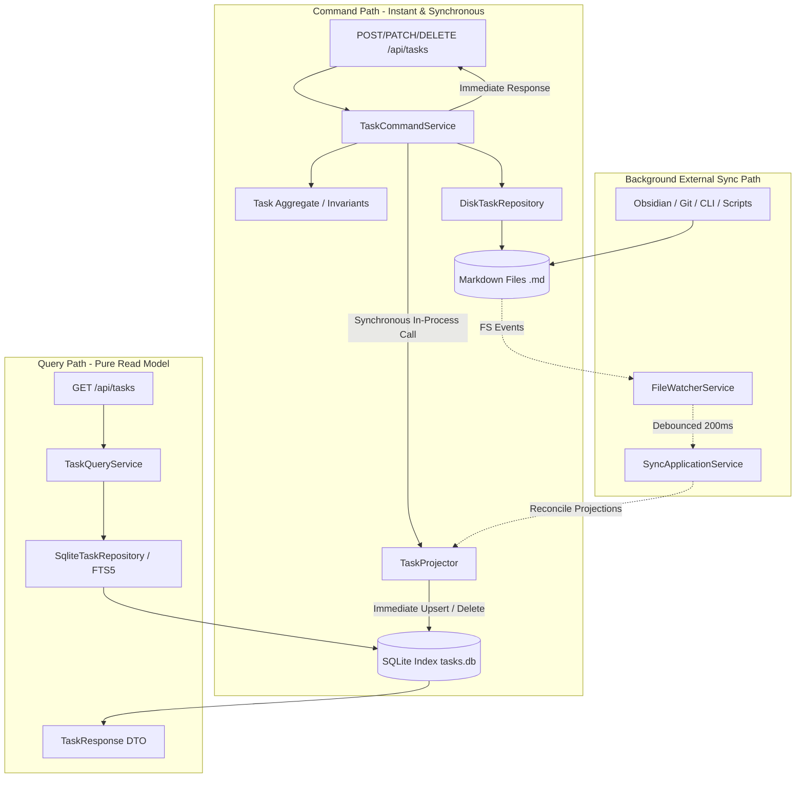

# ADR 5: Explicit In-Process CQRS and Architecture Enforcement

- **Status**: Accepted
- **Date**: 2026-10-04
- **Author**: Antigravity (AI Coding Assistant) & User

## Context

Jotter is built on the "file-over-app" philosophy, where Markdown files (`<id>.md`) in project directories serve as the authoritative Single Source of Truth (SSoT). To achieve millisecond search, sorting, tag querying, and complex kanban filters, an ephemeral SQLite database (`tasks.db`) is maintained alongside the Markdown files.

Originally, this dual-storage model was handled implicitly within a monolithic `TaskApplicationService`. Every task creation or mutation triggered an informal "dual-write" (`disk_repo.save` followed by `sqlite_repo.upsert_task`), and queries read from the SQLite repository with ad-hoc fallbacks to disk.

While effective, this had architectural drawbacks:
1. **Implicit CQRS**: The system implemented Command Query Responsibility Segregation (CQRS) without naming it or separating concerns cleanly.
2. **Coupled Service Responsibilities**: `TaskApplicationService` mixed domain invariant validation, disk filesystem I/O, FTS5 full-text indexing, and complex read queries in a single class.
3. **No Architectural Boundaries**: Nothing prevented new controllers, background tasks, or subagents from inadvertently reading from disk during queries, or bypassing projection updates during mutations.

## Decision

We decided to formalize and refactor Jotter's backend into an **Explicit In-Process CQRS** architecture with zero added latency, and enforce its structural boundaries using architecture testing (`pytest-archon`).

### 1. In-Process CQRS Separation

Specifically:
- **`TaskCommandService` (Write Model)**:
  - Responsible for domain invariant enforcement and mutating task aggregates.
  - Persists authoritatively to disk using `DiskTaskRepository`.
  - Immediately invokes `TaskProjector` to project updates into the SQLite index in-process (guaranteeing 0ms added latency and read-your-own-writes consistency).
- **`TaskQueryService` (Read Model)**:
  - Pure query service that reads strictly from SQLite using `SqliteTaskRepository`.
  - Zero disk I/O, zero YAML parsing, zero mutation side effects.
- **`TaskProjector` (Projection Layer)**:
  - Explicitly owns the projection of domain state into the SQLite `tasks` table and FTS5 search index.
  - Shared by both `TaskCommandService` (inline app mutations) and `SyncApplicationService` / `FileWatcherService` (external disk changes).
- **`TaskApplicationService` (Facade)**:
  - Maintained as a composite facade delegating to `TaskCommandService` and `TaskQueryService` for full backwards compatibility across the application and MCP server.

### 2. Architecture Enforcement with `pytest-archon`

To guarantee that future development preserves these boundaries, we introduced architecture unit tests in [`tests/test_architecture.py`](file:///home/simon/Code/jotter/tests/test_architecture.py):

1. **Query Isolation**: `TaskQueryService` is strictly forbidden from importing `DiskTaskRepository`.
2. **Pure Domain**: Domain entities and value objects must never import database drivers (`sqlite3`), repositories, or application services.
3. **Layer Decoupling**: HTTP routers must depend on application services and never directly import low-level repositories.
4. **Projector Ownership**: `TaskCommandService` routes SQLite projections exclusively through `TaskProjector` rather than `SqliteTaskRepository`.

## Rationale

- **Zero Added Latency**: Unlike distributed CQRS architectures that rely on message queues (e.g. Kafka, RabbitMQ) and suffer from UI eventual consistency lag, in-process CQRS executes the projection synchronously in the same request thread.
- **Clean Mental Model**: Clear separation between write rules (YAML frontmatter, disk storage, invariants) and read models (indexing, FTS5 token search, compound filtering).
- **Automated Guardrails**: `pytest-archon` acts like Java's ArchUnit in CI, failing builds automatically if an architectural boundary is violated.

## Consequences

- New read endpoints should be added to `TaskQueryService`, while state-modifying actions belong in `TaskCommandService`.
- `pytest-archon` is added as a development dependency in `pyproject.toml`.
