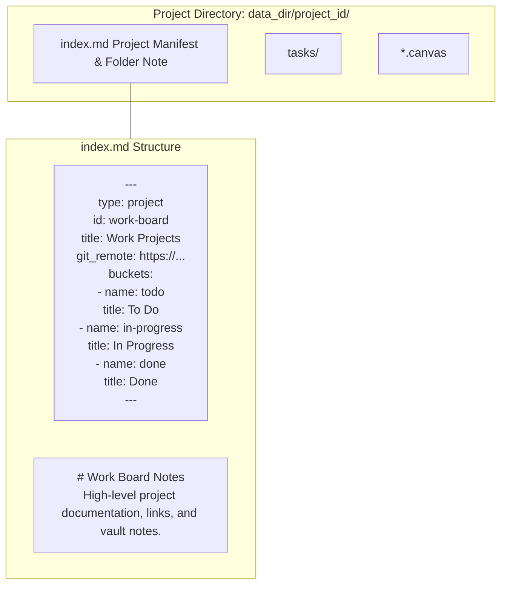

# ADR 7: Project Manifest (`index.md`) & Obsidian Folder Notes Integration

- **Status**: Accepted
- **Date**: 2026-08-15
- **Author**: Antigravity (AI Coding Assistant) & User

## Context

In early versions of Jotter, workspace projects and column buckets were tracked centrally in a global `projects.json` file inside the root data directory. Individual tasks were written to disk as `.md` files, but the board configuration (column titles, display order, colors, git remote URLs) resided separately in JSON.

This created several architectural limitations:
1. **Broken Vault Portability**: A project subfolder copied or synced to another device lacked column definitions and project metadata without also copying the central `projects.json`.
2. **Poor PKM & Obsidian Interoperability**: In personal knowledge management tools like Obsidian, Logseq, or Foam, users organize knowledge folders hierarchically. A common convention (the **Obsidian Folder Notes** pattern) places an `index.md` or `<folder>.md` note at the root of a folder to represent the folder itself.
3. **Merge Conflict Hazards**: Concurrent edits to multiple boards caused merge conflicts in the single central `projects.json` file during Git sync.

## Decision

We decided to **deprecate `projects.json` and adopt the Open Knowledge Format (OKF) with Obsidian Folder Notes manifests (`index.md`)** for all project definitions.

Specifically:

1. **Manifest File Structure (`<project_id>/index.md`)**:
   - Every project folder contains an `index.md` file.
   - The YAML frontmatter declares the project entity (`type: project`, `id`, `title`, `description`, `git_remote`, `done_clean_period`) and an embedded array of column buckets (`buckets`).
   - The Markdown body is preserved for user documentation, board guidelines, or notes, which are displayed seamlessly in Obsidian as a Folder Note.
2. **Transparent Migration on Boot**:
   - The backend `SyncApplicationService` automatically migrates legacy `projects.json` files on startup into `index.md` files in each project directory.
   - If a user manually drops an existing Markdown folder into the workspace without an `index.md`, the system automatically synthesizes a default manifest preserving standard columns (`todo`, `in-progress`, `done`).
3. **Atomic Persistence**:
   - When project settings, columns, or layout configurations are edited in Jotter, the changes are written atomically to `<project_id>/index.md`.

## Rationale

- **Pure File-over-App Design**: Every project directory is completely autonomous and self-describing. Copying or cloning `<project_id>/` carries all board definitions, tasks, and canvas files with zero external dependencies.
- **Obsidian Ecosystem Compatibility**: Opens directly as an Obsidian Folder Note with full visual markdown support.
- **Conflict Isolation**: Changes to Project A's columns never conflict with Project B during Git synchronization.

## Consequences

- Project directories must reserve the filename `index.md`; it is treated as a project manifest and excluded from being parsed as an individual task card.
- Bucket order and column metadata are serialized in `index.md` YAML, so manual edits by users in external text editors must preserve valid YAML syntax.
