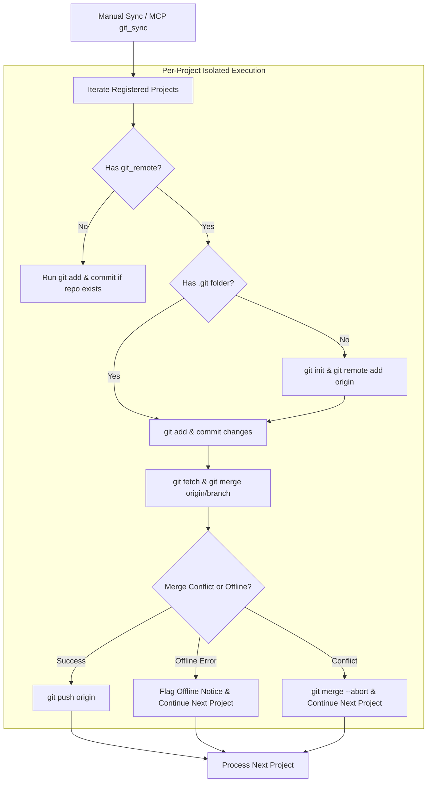

# ADR 8: Selective Per-Project Git Synchronization and Offline Isolation

- **Status**: Accepted
- **Date**: 2026-09-15
- **Author**: Antigravity (AI Coding Assistant) & User

## Context

Users frequently maintain different categories of tasks within the same Jotter instance:
- Personal tasks (which should stay private or sync to a personal private Git repo).
- Work/team tasks (which sync to a company Git forge like GitHub, GitLab, or Gitea).
- Sensitive/local-only notes (which must never leave the local machine).

In standard task management or note-taking systems, Git sync is typically all-or-nothing: the entire workspace directory is bound to a single Git repository. This created several critical issues:
1. **Privacy & Security Boundaries**: Personal and confidential company tasks cannot coexist in a single top-level Git repository.
2. **Cascading Sync Failures**: If one remote is unreachable (e.g. company VPN is off while traveling, or internet is offline), the entire sync process fails.
3. **Merge Conflict Blast Radius**: A merge conflict in one project would block synchronization for all other unrelated projects.

## Decision

We decided to implement **Selective, Per-Project Git Synchronization with Workspace Fallback** and resilient offline failure detection (`src/jotter/features/sync/git_adapter.py`).

Specifically:

1. **Per-Project Repositories**:
   - Each project folder `<data_dir>/<project_id>` can act as an independent Git repository with its own `.git` directory and distinct remote origin (`git_remote`).
   - If a project does not have a `git_remote` configured, but is part of an overarching Git workspace, local commits are still created to provide local version history and time machine rollback points.
2. **Offline Detection & Fault Isolation**:
   - Network errors (`could not resolve host`, `failed to connect`, `temporary failure in name resolution`, `ssh: connect to host`) are classified via `is_offline_error()`.
   - When a network or authentication error occurs on Project A, Jotter logs a clean status message and continues synchronizing Project B without crashing.
3. **Safety Rollback & Pre-Restore Commits**:
   - The "Time Machine" feature allows rolling back project states to prior Git snapshots.
   - Before any destructive reset or checkout is executed, Jotter automatically creates a safety snapshot commit (`Pre-restore backup`), guaranteeing that accidental rollbacks can themselves be undone.

## Rationale

- **Strict Multi-Tenant Privacy**: Work boards sync strictly to enterprise remotes while personal boards sync to personal remotes or stay completely offline.
- **Resilience**: Temporary loss of connectivity to one host (e.g. self-hosted corporate GitLab behind a VPN) does not disrupt sync for public or cloud-hosted projects.
- **No External Sync Server**: Relies purely on standard, auditable, platform-native `git` CLI operations.

## Consequences

- The host system must have the `git` CLI installed on PATH to execute remote sync operations. If `git` is absent, Jotter logs a graceful warning and skips Git steps.
- Each Git-enabled project maintains its own `.git/` folder inside the project directory, which must be ignored by file watchers and search indexes.
