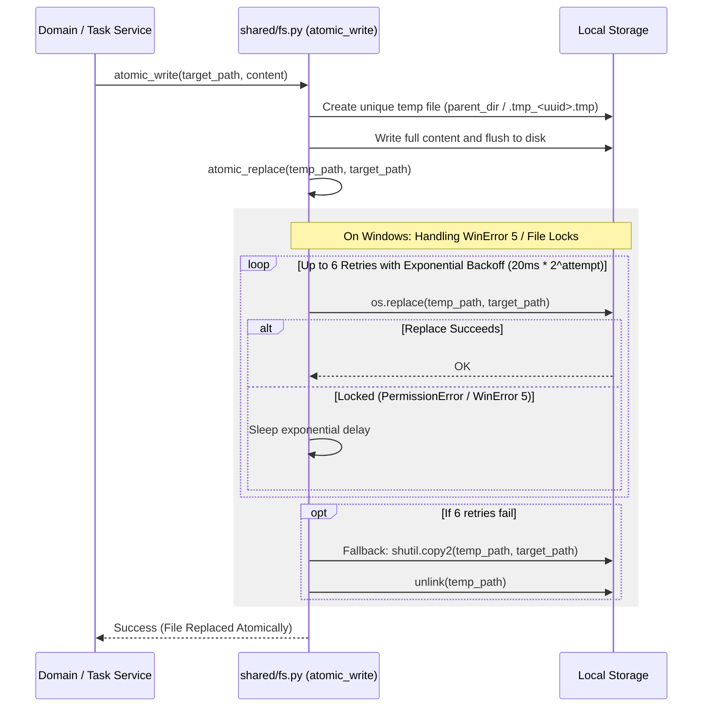

# ADR 9: Cross-Platform Atomic Filesystem Writes with Exponential Backoff

- **Status**: Accepted
- **Date**: 2026-09-20
- **Author**: Antigravity (AI Coding Assistant) & User

## Context

As a "file-over-app" system, Jotter continuously reads and writes plain-text Markdown (`.md`), YAML manifests (`index.md`), and JSON Canvas files (`.canvas`) directly to the local filesystem.

In practice, operating systems and desktop environments exhibit complex filesystem behaviors during concurrent access:
1. **Windows File Locking (`WinError 5 / PermissionError`)**:
   - On Windows, files opened by background indexers (Windows Search Indexer, antivirus scanners, file synchronization clients like Syncthing or Dropbox) cannot be renamed or replaced via `os.replace()` while a read handle is momentarily held.
   - Calling `os.replace(src, dst)` when the target file is locked raises `PermissionError: [WinError 5] Access is denied`.
2. **Partial Write Hazards**:
   - Direct in-place writes (`with open(path, "w") as f: f.write(content)`) risk corrupting or truncating user data if the process is terminated, loses power, or encounters an unhandled exception midway through writing.
3. **Watcher Event Flooding**:
   - Writing files in-place causes multiple rapid OS filesystem events (e.g. truncate, write chunks, close), causing file watchers to trigger premature re-index cycles on incomplete data.

## Decision

We decided to implement a centralized, robust atomic writing and replacement pipeline in [`src/jotter/shared/fs.py`](file:///home/simon/Code/jotter/src/jotter/shared/fs.py) using temporary file staging, exponential backoff retries, and fallback copy mechanics.

Specifically:

1. **Staged Temporary Writes (`atomic_write`)**:
   - All disk mutations first write string content into a temporary file created in the same directory as the destination (`dir=parent_dir`, prefix `.tmp_`, suffix `.tmp`). Writing in the same directory guarantees that both temporary and target files reside on the same filesystem mount/volume, allowing atomic filesystem renames.
2. **Resilient Replacement with Backoff (`atomic_replace`)**:
   - `atomic_replace` attempts `Path.replace(dst)`.
   - If a `PermissionError` or transient `OSError` occurs (e.g. sharing violation on Windows), the operation retries up to 6 times with exponential backoff (starting at 20ms: 20ms, 40ms, 80ms, 160ms, 320ms, 640ms).
3. **Last-Resort Copy Fallback**:
   - If replacement still fails after 6 retries, it executes a fallback copy (`shutil.copy2`) followed by removing the temporary file, ensuring user data is never lost.
4. **Watcher & Index Filter**:
   - The file watcher and markdown indexer explicitly ignore files matching the `.tmp_*` prefix.

## Rationale

- **Data Safety Guaranteed**: Target files are either updated completely or untouched; zero risk of corrupted, zero-byte, or half-written markdown files.
- **Cross-Platform Parity**: Eliminates Windows-specific permission crashes caused by background antivirus scans and file synchronization clients without requiring platform-specific branching in service layers.
- **Zero Third-Party Binary Dependencies**: Implemented purely using Python standard library primitives (`tempfile`, `pathlib`, `shutil`, `time`, `os`).

## Consequences

- All disk writes throughout the codebase (tasks, manifests, settings, canvases) must use `atomic_write` rather than standard `open(..., "w")`.
- Temporary `.tmp_*` files should be cleaned up during sync reconciliation if any orphaned files remain after hard system crashes.
