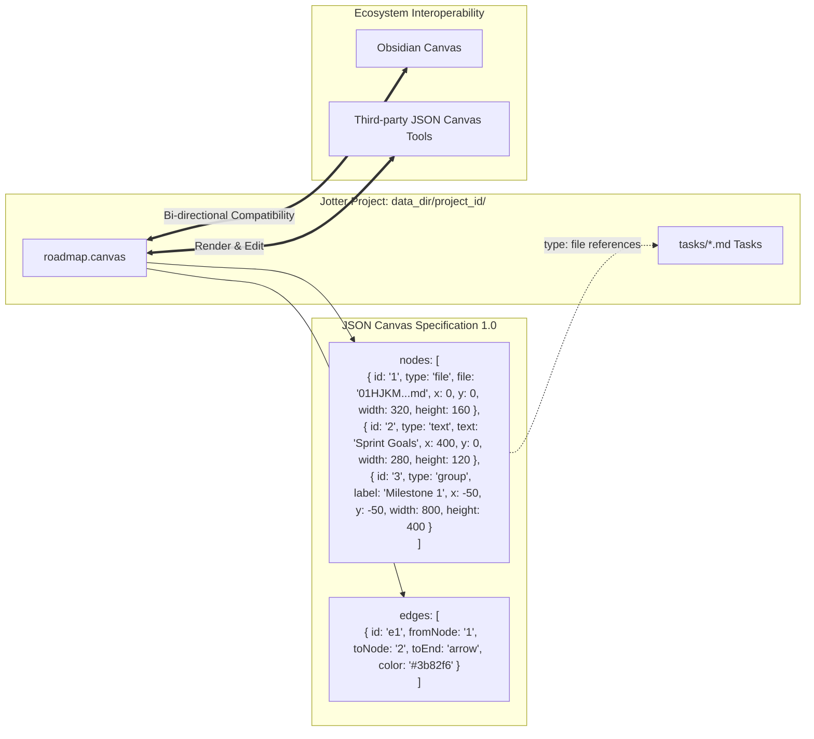

# ADR 10: Adopting the Open JSON Canvas Format for Visual 2D Boards

- **Status**: Accepted
- **Date**: 2026-09-28
- **Author**: Antigravity (AI Coding Assistant) & User

## Context

While Kanban columns, list tables, and Eisenhower matrices provide powerful structured views, complex workflows often require 2D spatial arrangement: connecting dependencies, grouping items visually, creating mindmaps, and organizing project phases on an infinite 2D plane.

When implementing the 2D infinite canvas feature in Jotter, we evaluated several design options for storing canvas node and edge data:

1. **Inline Coordinate Fields in Task Markdown**: Add `position_x`, `position_y`, `canvas_width`, and `canvas_height` to each task's YAML frontmatter.
   - *Problem*: Pollutes plain-text task files with ephemeral viewport styling; fails to support independent multiple canvases within the same project; cannot store non-task text notes, groups, or directional connecting lines.
2. **Proprietary JSON Format**: Create a Jotter-specific JSON layout format (e.g. `board.canvas.json`).
   - *Problem*: Violates the "file-over-app" philosophy by locking visual boards into a single proprietary application.
3. **Open JSON Canvas Specification (`.canvas`)**: Adopt the open specification established by the Obsidian Canvas community (`jsoncanvas.org`).

## Decision

We decided to **adopt the open JSON Canvas specification (`.canvas`)** as the native persistence and data interchange format for Jotter's 2D canvas feature.

Specifically:

1. **File Placement & Naming**:
   - Canvas files are saved directly in the project directory as `<project_id>/<canvas_name>.canvas` (e.g. `main.canvas`, `architecture.canvas`).
2. **Standard Node Types**:
   - `file`: References a task Markdown file inside the project (`file: "tasks/<id>.md"` or `<id>.md`). When rendered in Jotter, the card displays live task properties (status, priority, due date, tags).
   - `text`: Floating Markdown text notes with customizable dimensions and colors.
   - `group`: Enclosing spatial containers grouping related nodes together.
3. **Standard Edge Connections**:
   - Connects source and target nodes with directional arrows, colors, and line labels.
4. **Service & Route Layer**:
   - Managed via `src/jotter/features/canvas/service.py` on backend and `frontend/src/stores/canvasStore.ts` on frontend.
   - Git synchronization (`src/jotter/features/sync/git_adapter.py`) automatically tracks, commits, and restores `.canvas` files alongside tasks.

## Rationale

- **Ecosystem Portability**: Canvases designed in Jotter can be opened and edited directly in Obsidian Canvas (and vice versa) without any export or conversion steps.
- **Support for Multiple Visual Boards**: Projects can have multiple named canvases (e.g. `sprint-1.canvas`, `system-architecture.canvas`).
- **Clean Task Separation**: Tasks remain pure markdown documents focused on content, while spatial relationships are externalized cleanly into `.canvas` documents.

## Consequences

- The frontend canvas renderer must preserve any extra JSON Canvas properties added by external tools (e.g. custom colors, edge labels) when saving changes back to disk.
- Task IDs placed onto a canvas are referenced by relative file paths, requiring the frontend and backend to resolve task metadata gracefully even if a task is marked done or archived.
