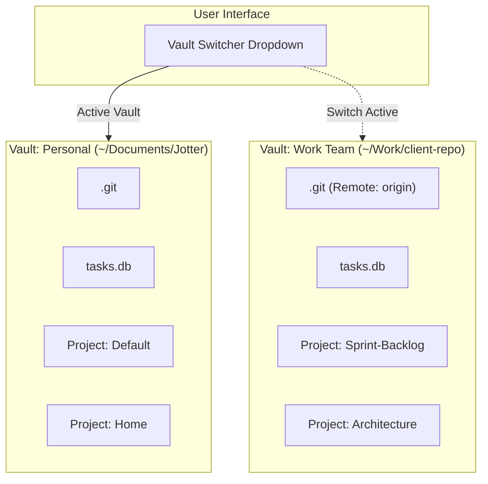

# ADR 0012: Vault Abstraction and Simplified Git Sync

## Status
Accepted

## Context
Earlier versions of Jotter operated on a single global `data_dir` containing all projects. To enable users to collaborate with coworkers on specific projects, Jotter implemented selective per-project Git sync ([ADR 0008](file:///home/simon/Code/jotter/docs/developer/adr/0008-selective-per-project-git-sync.md)). 

While functional, supporting both a global workspace repository and nested per-project sub-repositories introduced significant architectural complexity:
1. **Nested Git Repositories**: Managing submodules, nested `.git` folders, and dynamic `.gitignore` files was brittle and error-prone.
2. **Commit Traversal Complexity**: The "Time Machine" feature had to heuristically search both project subdirectories and parent directories to resolve commit history.
3. **Ambiguous Boundaries**: Users lacked a clean mental separation between completely private workspaces and shared team environments.

Similar file-based Markdown productivity tools (like Obsidian) solve this problem by organizing workspaces into **Vaults**.

## Decision
We introduce a **Vault** abstraction above projects, establishing a clean hierarchy:
$$\text{Vault} \longrightarrow \text{Projects} \longrightarrow \text{Buckets} \longrightarrow \text{Tasks}$$

1. **Vault as the Unit of Physical Storage & Git Versioning**:
   - A Vault represents an isolated folder on disk.
   - Exactly **one Git repository** exists per Vault (1:1 mapping).
   - Each Vault maintains its own independent SQLite projection index (`tasks.db`).
   - The background filesystem watcher (`FileWatcherService`) monitors the active Vault directory.

2. **Simplified Git Synchronization**:
   - Complex nested repository detection is superseded by a single Vault Git root.
   - `git_sync` operates on the active Vault directory with clean, predictable push/pull semantics.
   - The "Time Machine" queries file revisions (`git log -- <project>/<task>.md`) directly from the Vault's single repository.
   - Existing project-level Git repos are retained as an automatic local fallback for backwards compatibility.

3. **Multi-Vault Switching**:
   - Vault registrations and the active vault are maintained in a global registry (`~/.config/jotter/vaults.json`).
   - Switching vaults re-targets the active directory, switches the SQLite database connection, runs initial reconciliation, and points the background file watcher to the new vault without restarting the server.
   - The frontend provides a dropdown switcher in the sidebar.

## Consequences

### Positive
- **Architectural Clarity**: Decouples project organization from physical Git repository boundaries.
- **Git Reliability**: Eliminates nested repository conflicts and dynamic `.gitignore` overwriting.
- **Seamless Collaboration**: Users can clone coworker repositories as separate vaults without polluting their personal projects.
- **Zero-Friction Migration**: Existing installations automatically seed the current `data_dir` as the `"default"` vault on startup.

### Negative / Trade-offs
- Users who previously relied on nested git repositories inside a single folder are encouraged to separate them into distinct vaults.
