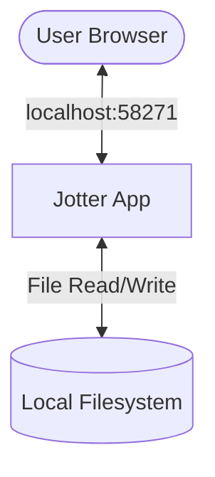
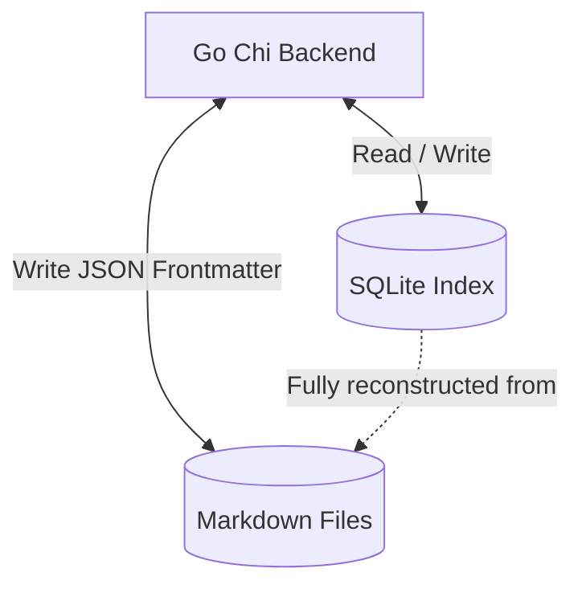
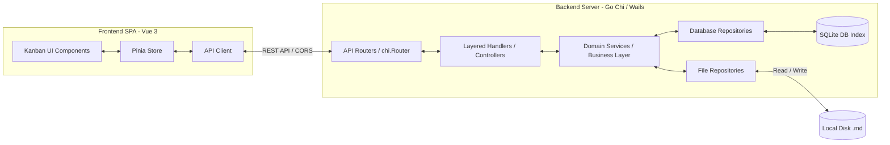
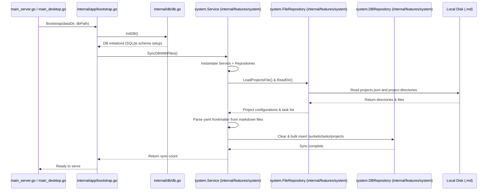

# Architectural Architecture: Jotter (arc42)

This document describes the architecture of **Jotter** using the standardized **arc42 template**.

---

## 1. Introduction and Goals

Jotter is a local-first, non-commercial task management application designed to replace cloud-based kanban boards like MS Planner.

### 1.1 Requirements Overview

- **Anti-Flooding**: Aggressive task filtering (e.g. hiding the "Done" column) to prevent visual overwhelm.
- **Plain-text Portability**: Use human-readable Markdown files as the primary format so tasks remain accessible outside the app.
- **Speed**: Instantaneous filtering, search, and drag-and-drop actions.

### 1.2 Quality Goals

1. **Data Sovereignty & Compliance**: No cloud syncing, pure local-first file storage.
2. **Robustness**: The indexed database state must always be fully reconstructible from the text files.
3. **Low Latency**: UI updates should feel snappy, even with 1000+ tasks.

---

## 2. Architecture Constraints

- **Platform Independent**: Executable binaries must be provided for Linux, macOS, and Windows.
- **Offline-First**: Must run locally without requiring any network access.
- **Zero Dependency Startup**: Pre-compiled single-file binaries must run without requiring Python/Node runtimes on the host machine.

---

## 3. Context and Scope



- **User**: Interacts with Jotter through a modern web browser.
- **Jotter App**: Serves the frontend bundle and exposes a local REST API.
- **Local Filesystem**: Contains the user's tasks stored as `.md` files in a structured directories format.

---

## 4. Solution Strategy

Jotter employs the **"Ephemeral Index" Pattern** to combine the benefits of relational databases (fast searching, sorting, and joins) with the longevity of text files:



- **Single Source of Truth (SSoT)**: Markdown (`.md`) files. Task title, bucket, position, tags, and due date are stored in the file's YAML Frontmatter, while description notes are written in the Markdown body.
- **The Index Engine**: An in-memory/ephemeral SQLite database. On startup, it parses the Markdown files and constructs a relational table for rapid API operations.
- **Auto-Reconstruction**: If the SQLite database is deleted or corrupted, the system automatically rebuilds it on startup from the Markdown files.

---

## 5. Building Block View



### 5.1 Frontend (Vue 3 Single Page Application)

- **Kanban UI Components**: Vue components (`BoardView.vue`, `TaskCard.vue`) styled with Tailwind CSS.
- **Pinia Store**: Manages client-side settings (such as local preference persistence) synced with `localStorage`.
- **API Client**: Interacts with the backend routes.

### 5.2 Backend (Go Chi / Wails)

Jotter is built using a clean, layered architectural design divided into modular feature packages (`internal/features/...`): `project`, `bucket`, `task`, `settings`, and `system`. Each feature package consists of three decoupled layers (perfectly matching Spring Boot's Controller-Service-Repository separation):

1. **Handlers (Controller Layer)**:
   - Registers feature-specific REST endpoints (`RegisterRoutes`).
   - Acts as the entry point for HTTP requests.
   - Parses request parameters and decodes request payloads into Go struct DTOs (Data Transfer Objects).
   - Translates domain-level responses or errors into standard HTTP status codes and JSON responses.
2. **Services (Business Logic / Domain Layer)**:
   - Contains pure business logic, input validation, and business rule evaluation.
   - Coordinates multi-repository operations (e.g., ensuring disk storage and the SQLite index remain synchronized).
   - Handles advanced file-system operations such as multi-part attachment uploads, task list filtering, and project-scoped auto-pruning.
3. **Repositories (Data Access / Persistence Layer)**:
   - **Database Repository (SQLite Repositories)**: Interacts directly with the local ephemeral SQLite index database (`modernc.org/sqlite`) using structured SQL queries.
   - **File Repository (Disk Repositories)**: Directly interacts with the host filesystem to read/write Markdown YAML frontmatter files, JSON configuration registries (`projects.json`), and binary/text attachment files.

---

## 6. Runtime View

### 6.1 Server Startup and Initialization

When Jotter starts, it goes through a synchronization phase to align the database index with the local files:



---

## 7. Deployment View

Jotter is packaged into two separate native binaries:

1. **`jotter-desktop` (GUI)**: A full desktop application bundled using **Wails**. It opens a native webview window and runs the embedded frontend.
2. **`jotter-server` (Server)**: A lightweight CLI binary that starts a standard HTTP server and serves the frontend to any modern web browser.

### Shared Packaging Features:

- **Assets Bundling**: The compiled frontend SPA bundle (`dist/`) is embedded inside the Go binary using `go:embed` and served natively.
- **Internal Logic**: Both binaries share the exact same underlying logic from the `internal/` packages, ensuring consistent behavior across modes.

---

## 8. Git Synchronization Logic

Jotter treats each project directory as a potential independent Git repository. The logic is implemented in `internal/features/common/git.go` (and orchestrated via `system.Service`'s file repository wrapper) and is triggered sequentially for all configured projects during a system sync.

### The Per-Project Sync Flow:

1. **Discovery**: The backend queries the database for all projects that have a `git_remote` URL.
2. **Auto-Setup**: For each project, Jotter checks if a `.git` folder exists. If not, it executes `git init` and `git remote add origin` before proceeding.
3. **Commit**: Runs `git add .` and `git commit` inside the project subdirectory.
4. **Fetch & Merge**: Fetches from `origin` and attempts a safe merge (Fast-Forward first, then Recursive).
5. **Conflict Isolation**: Conflicts are handled on a per-project basis. If Project A has a conflict, it will abort that project's merge, but Project B will still continue to sync.
6. **Push**: Successful merges are pushed to the project-specific remote.

This architecture enables **selective sharing**, where different boards can be shared with different teams or kept strictly local.

---

## 9. Data Model

### 8.1 Markdown YAML Frontmatter

Each task file is named following the pattern `[id]-[title-slug].md`. The metadata is serialized as YAML Frontmatter:

```yaml
---
id: 1042
project_id: default
title: Fix Authentication
bucket: todo
position: 2000.0
tags:
  - backend
  - auth
due_date: 2026-06-30
priority: high
created_at: 2026-06-04T12:00:00Z
The notes regarding this task go here, using standard markdown formatting.
```

---

## 10. API & Swagger Documentation

Jotter includes fully-automated OpenAPI 2.0 (Swagger) specification generation and an integrated Swagger UI served directly from the headless server.

- **OpenAPI Annotations**: Every handler/controller is fully annotated using `@Summary`, `@Description`, `@Tags`, `@Accept`, `@Produce`, `@Param`, `@Success`, `@Failure`, and `@Router`.
- **Swagger UI Endpoint**: When running `jotter-server` (or in headless mode), the Swagger UI is accessible at `http://<server-host>:<port>/swagger/index.html` (e.g., `http://localhost:58271/swagger/index.html`).
- **Regenerating Docs**: To regenerate the Swagger documentation after editing endpoint handlers, run:
  ```bash
  npm run swagger:generate
  ```
  This uses the `swag` CLI tool to parse comments in `internal/features/` and output updated spec files to `internal/docs/`.
