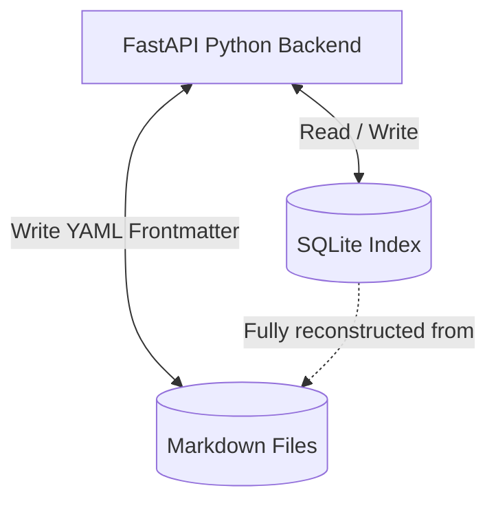
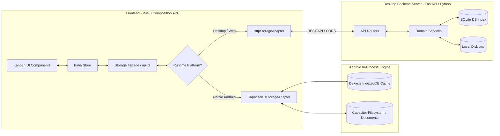
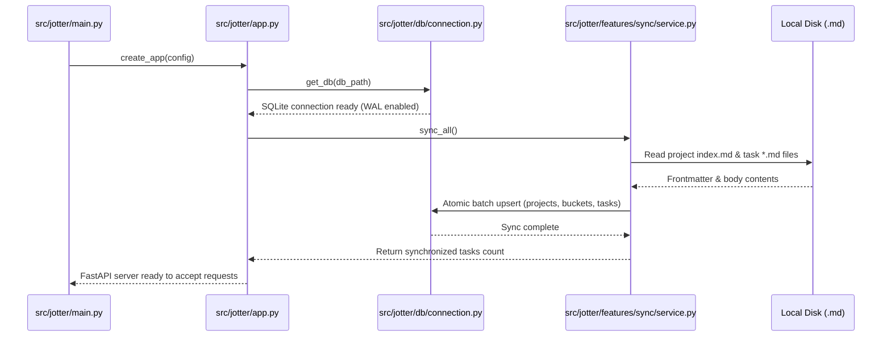

# Architectural Architecture: Jotter (arc42)

This document describes the architecture of **Jotter** using the standardized **arc42 template**.

---

## 1. Introduction and Goals

Jotter is a local-first, non-commercial task management application designed to replace cloud-based kanban boards like MS Planner.

### 1.1 Requirements Overview

- **Anti-Flooding**: Aggressive task filtering (e.g. hiding the "Done" column) to prevent visual overwhelm.
- **Plain-text Portability**: Use human-readable Markdown files as the primary format so tasks remain accessible outside the app.
- **Speed**: Instantaneous filtering, search, and drag-and-drop actions.

### 1.2 Quality Goals

1. **Data Sovereignty & Compliance**: No cloud syncing, pure local-first file storage.
2. **Robustness**: The indexed database state must always be fully reconstructible from the text files.
3. **Low Latency**: UI updates should feel snappy, even with 1000+ tasks.

---

## 2. Architecture Constraints

- **Platform Independent**: Python 3.12+ runtime support across Linux, macOS, and Windows.
- **Offline-First**: Must run locally without requiring external cloud access.
- **Script-Based Security Compliance**: Pure source script execution (no opaque compiled binary executables).

---

## 3. Context and Scope


- **User**: Interacts with Jotter through a modern web browser.
- **Jotter App**: FastAPI application serving the Vue 3 frontend bundle and exposing a local REST API.
- **Local Filesystem**: Contains the user's tasks stored as `.md` files in a structured directory format.

---

## 4. Solution Strategy

Jotter employs the **"Ephemeral Index" Pattern** to combine the benefits of relational databases (fast searching, sorting, and joins) with the longevity of text files:



- **Single Source of Truth (SSoT)**: Markdown (`.md`) files. Task title, bucket, position, tags, and due date are stored in the file's YAML Frontmatter, while description notes are written in the Markdown body.
- **The Index Engine**: An in-memory/ephemeral SQLite database. On startup, it parses the Markdown files and constructs a relational table for rapid API operations.
- **Auto-Reconstruction**: If the SQLite database is deleted or corrupted, the system automatically rebuilds it on startup from the Markdown files.

---

## 5. Building Block View



### 5.1 Frontend (Vue 3 Single Page Application & Mobile App)

- **Kanban UI Components**: Vue 3 Composition API components (`<script setup lang="ts">`) styled with Tailwind CSS, responsive mobile navigation bar, and haptic feedback.
- **Pinia Stores**: Manages client-side settings, current project, active filters, selection states, and pomodoro timer.
- **Storage Layer Abstraction (`StorageAdapter`)**:
  - `HttpStorageAdapter`: Handles communication with the FastAPI desktop backend.
  - `CapacitorFsStorageAdapter`: In-process TypeScript storage engine for Android that reads/writes raw `.md` markdown files directly on Android documents storage while maintaining an IndexedDB cache via Dexie.js for millisecond search/filter queries.

### 5.2 Backend (FastAPI Python Application)

Jotter is built using a clean, layered architectural design divided into modular feature packages (`src/jotter/features/...`): `projects`, `buckets`, `tasks`, `settings`, and `sync`.

1. **Routes (Controller Layer)**:
   - Registers feature-specific REST endpoints (`projects/router.py`, `buckets/router.py`, `tasks/router.py`, `settings/router.py`, `system/router.py`).
   - Parses request parameters, query filters, and validates request payloads into Pydantic DTO models.
   - Translates domain-level responses and exceptions into standard HTTP status codes and JSON responses.

2. **Services (Business Logic Layer)**:
   - Contains pure business logic, input validation, and coordinates operations between disk files and the SQLite index.
   - Handles advanced file-system operations such as multi-part attachment uploads, task list filtering, and project-scoped auto-pruning.

3. **Data Access (SQLite Index & Filesystem Repositories)**:
   - **Database Index**: Interacts directly with the local ephemeral SQLite index database (`tasks.db`) using structured SQL queries with WAL mode enabled.
   - **Filesystem**: Reads and writes Markdown files compliant with the Open Knowledge Format (OKF) and Obsidian Folder Notes (`<project_id>/index.md` project manifests and `<project_id>/tasks/<id>.md` task files), configuration files (`jotter.yaml`, `settings.json`), and binary/text attachment files.

---

## 6. Runtime View

### 6.1 Server Startup and Initialization

When Jotter starts, it goes through a synchronization phase to align the database index with the local files:



---

## 7. Deployment View

Jotter is deployed as a lightweight client-server web application:

1. **Backend**: Python 3 (FastAPI + Uvicorn) serving REST endpoints and static files.
2. **Frontend**: Built Single Page Application (Vue 3 + Vite + Tailwind CSS) served directly from `frontend/dist/`.

Running Jotter:
```bash
pip install -e .
jotter
```

---

## 8. Git Synchronization Logic

Jotter treats each project directory as a potential independent Git repository. The logic is implemented in `src/jotter/features/git/service.py` and is triggered sequentially for all configured projects during a system sync.

### The Per-Project Sync Flow:

1. **Discovery**: The backend queries the database for all projects that have a `git_remote` URL.
2. **Auto-Setup**: For each project, Jotter checks if a `.git` folder exists. If not, it executes `git init` and `git remote add origin` before proceeding.
3. **Commit**: Runs `git add .` and `git commit` inside the project subdirectory.
4. **Fetch & Merge**: Fetches from `origin` and attempts a safe merge (Fast-Forward first, then Recursive).
5. **Conflict Isolation**: Conflicts are handled on a per-project basis. If Project A has a conflict, it will abort that project's merge, but Project B will still continue to sync.
6. **Push**: Successful merges are pushed to the project-specific remote.

This architecture enables **selective sharing**, where different boards can be shared with different teams or kept strictly local.

---

## 9. Data Model

### 9.1 Task File Frontmatter (Open Knowledge Format)

Each task file is named after its ID (`<id>.md`). The metadata is serialized as YAML Frontmatter:

```yaml
---
type: task
id: 01HJKM7ST89AB234CDEFGHJKMN
project_id: default
title: Fix Authentication
status: todo
position: 2000.0
tags:
  - backend
  - auth
due_date: "2026-06-30"
priority: high
created_at: "2026-06-04T12:00:00Z"
updated_at: "2026-06-04T12:00:00Z"
---
The notes regarding this task go here, using standard markdown formatting.
```

### 9.2 Project Manifest (`index.md`)

Each project folder contains an `index.md` note defining board columns and project metadata:

```yaml
---
type: project
id: default
title: Main Project Board
git_remote: "https://github.com/user/my-tasks.git"
done_clean_period: "after_1_week"
buckets:
  - name: todo
    title: To Do
    position: 1000.0
    is_done: false
    collapsed: false
  - name: in-progress
    title: In Progress
    position: 2000.0
    is_done: false
    collapsed: false
  - name: done
    title: Done
    position: 3000.0
    is_done: true
    collapsed: false
---
Project overview notes and documentation.
```

---

## 10. API & OpenAPI Documentation

Jotter provides automated OpenAPI 3.0 documentation served directly by FastAPI.

- **Interactive API Docs**: When running the Jotter server, interactive documentation is available at `http://localhost:58271/docs` (Swagger UI) and `http://localhost:58271/redoc` (ReDoc).
