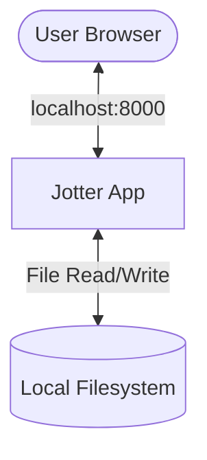
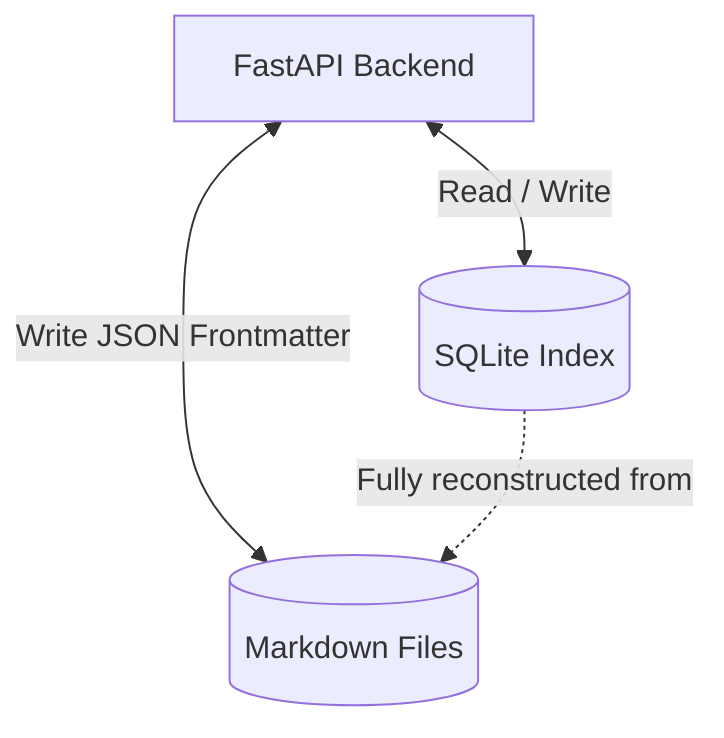
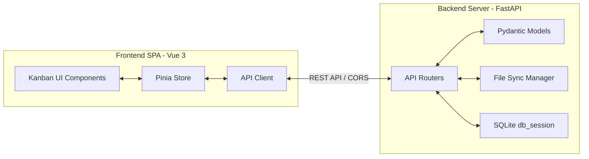
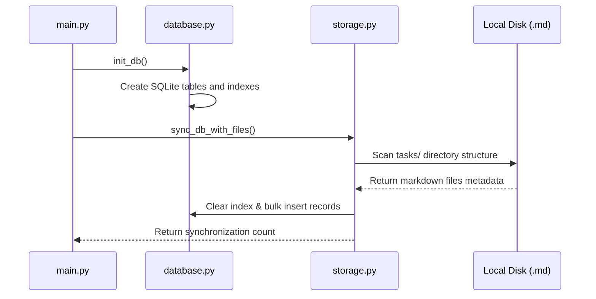

# Architectural Architecture: Jotter (arc42)

This document describes the architecture of **Jotter** using the standardized **arc42 template**.

---

## 1. Introduction and Goals

Jotter is a local-first, non-commercial task management application designed to replace cloud-based kanban boards like MS Planner.

### 1.1 Requirements Overview

- **Anti-Flooding**: Aggressive task filtering (e.g. hiding the "Done" column) to prevent visual overwhelm.
- **Plain-text Portability**: Use human-readable Markdown files as the primary format so tasks remain accessible outside the app.
- **Speed**: Instantaneous filtering, search, and drag-and-drop actions.

### 1.2 Quality Goals

1. **Data Sovereignty & Compliance**: No cloud syncing, pure local-first file storage.
2. **Robustness**: The indexed database state must always be fully reconstructible from the text files.
3. **Low Latency**: UI updates should feel snappy, even with 1000+ tasks.

---

## 2. Architecture Constraints

- **Platform Independent**: Executable binaries must be provided for Linux, macOS, and Windows.
- **Offline-First**: Must run locally without requiring any network access.
- **Zero Dependency Startup**: Pre-compiled single-file binaries must run without requiring Python/Node runtimes on the host machine.

---

## 3. Context and Scope



- **User**: Interacts with Jotter through a modern web browser.
- **Jotter App**: Serves the frontend bundle and exposes a local REST API.
- **Local Filesystem**: Contains the user's tasks stored as `.md` files in a structured directories format.

---

## 4. Solution Strategy

Jotter employs the **"Ephemeral Index" Pattern** to combine the benefits of relational databases (fast searching, sorting, and joins) with the longevity of text files:



- **Single Source of Truth (SSoT)**: Markdown (`.md`) files. Task title, bucket, position, tags, and due date are stored in the file's YAML Frontmatter, while description notes are written in the Markdown body.
- **The Index Engine**: An in-memory/ephemeral SQLite database. On startup, it parses the Markdown files and constructs a relational table for rapid API operations.
- **Auto-Reconstruction**: If the SQLite database is deleted or corrupted, the system automatically rebuilds it on startup from the Markdown files.

---

## 5. Building Block View



### 5.1 Frontend (Vue 3 Single Page Application)

- **Kanban UI Components**: Vue components (`BoardView.vue`, `TaskCard.vue`) styled with Tailwind CSS.
- **Pinia Store**: Manages client-side settings (such as local preference persistence) synced with `localStorage`.
- **API Client**: Interacts with the backend routes.

### 5.2 Backend (Python FastAPI)

- **API Routers**: Exposes endpoints for managing tasks, buckets, and projects.
- **Storage Manager**: Implements atomic writes to task files (writing to temporary files first before moving them into place) and handles folder migration.
- **SQLite Database**: Uses standard Python `sqlite3` in WAL (Write-Ahead Logging) mode.

---

## 6. Runtime View

### 6.1 Server Startup and Initialization

When Jotter starts, it goes through a synchronization phase to align the database index with the local files:



---

## 7. Deployment View

Jotter is packaged into single-file binary executables using **PyInstaller**:

- **Assets Bundling**: The compiled frontend SPA bundle (`dist/`) is packaged inside the binary and extracted into `sys._MEIPASS` at runtime.
- **Web Server Integration**: FastAPI routes serve the static assets from the extracted folder while running the API server.

---

## 8. Data Model

### 8.1 Markdown YAML Frontmatter

Each task file is named following the pattern `[id]-[title-slug].md`. The metadata is serialized as YAML Frontmatter:

```yaml
---
id: 1042
project_id: default
title: Fix Authentication
bucket: todo
position: 2000.0
tags:
  - backend
  - auth
due_date: 2026-06-30
priority: high
created_at: 2026-06-04T12:00:00Z
updated_at: 2026-06-04T12:05:00Z
---
The notes regarding this task go here, using standard markdown formatting.
```
