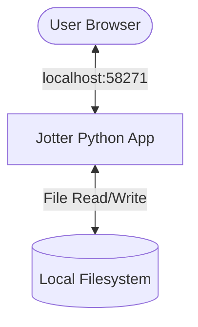
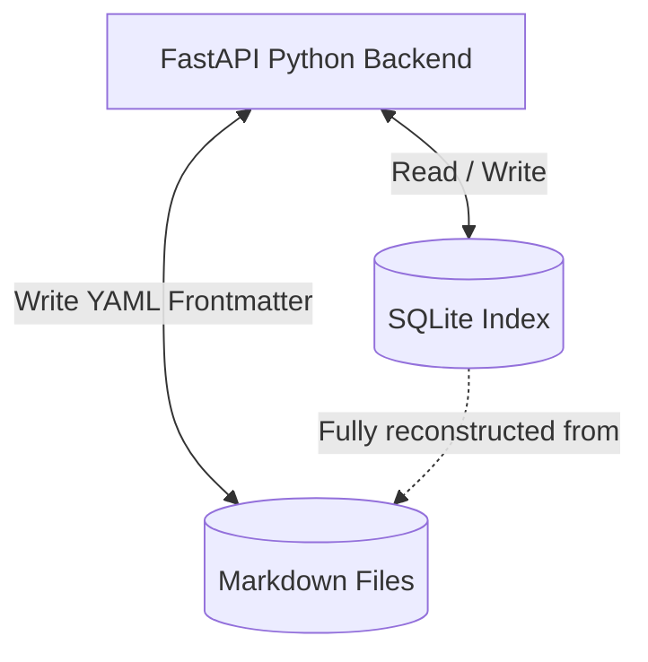
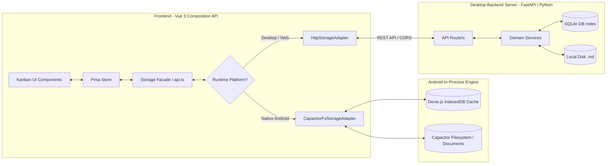
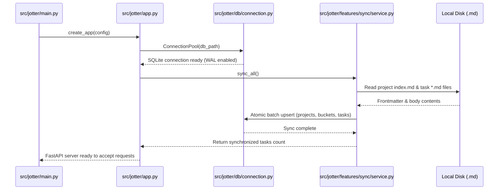

# Architectural Architecture: Jotter (arc42)

This document describes the architecture of **Jotter** using the standardized **arc42 template**.

---

## 1. Introduction and Goals

Jotter is a local-first, non-commercial task management application designed to replace cloud-based kanban boards like MS Planner.

### 1.1 Requirements Overview

- **Anti-Flooding**: Aggressive task filtering (e.g. hiding the "Done" column) to prevent visual overwhelm.
- **Plain-text Portability**: Use human-readable Markdown files as the primary format so tasks remain accessible outside the app.
- **Speed**: Instantaneous filtering, search, and drag-and-drop actions.

### 1.2 Quality Goals

1. **Data Sovereignty & Compliance**: No cloud syncing, pure local-first file storage.
2. **Robustness**: The indexed database state must always be fully reconstructible from the text files.
3. **Low Latency**: UI updates should feel snappy, even with 1000+ tasks.

---

## 2. Architecture Constraints

- **Platform Independent**: Python 3.12+ runtime support across Linux, macOS, and Windows.
- **Offline-First**: Must run locally without requiring external cloud access.
- **Script-Based Security Compliance**: Pure source script execution (no opaque compiled binary executables).

---

## 3. Context and Scope


```mermaid
flowchart TD
    User([User Browser]) <-->|localhost:58271| Jotter[Jotter Python App]
    Jotter <-->|File Read/Write| FS[(Local Filesystem)]
```

- **User**: Interacts with Jotter through a modern web browser.
- **Jotter App**: FastAPI application serving the Vue 3 frontend bundle and exposing a local REST API.
- **Local Filesystem**: Contains the user's tasks stored as `.md` files in a structured directory format.

---

## 4. Solution Strategy

Jotter employs the **"Ephemeral Index" Pattern** to combine the benefits of relational databases (fast searching, sorting, and joins) with the longevity of text files:


```mermaid
flowchart TD
    API[FastAPI Python Backend] <-->|Write YAML Frontmatter| Files[(Markdown Files)]
    API <-->|Read / Write| DB[(SQLite Index)]
    DB -.->|Fully reconstructed from| Files
```

- **Single Source of Truth (SSoT)**: Markdown (`.md`) files. Task title, bucket, position, tags, and due date are stored in the file's YAML Frontmatter, while description notes are written in the Markdown body.
- **The Index Engine**: An in-memory/ephemeral SQLite database. On startup, it parses the Markdown files and constructs a relational table for rapid API operations.
- **Auto-Reconstruction**: If the SQLite database is deleted or corrupted, the system automatically rebuilds it on startup from the Markdown files.

---

## 5. Building Block View


```mermaid
flowchart LR
    subgraph Frontend [Frontend - Vue 3 Composition API]
        UI[Kanban UI Components] <--> Store[Pinia Store]
        Store <--> Proxy[Storage Facade / api.ts]
        Proxy <--> Adapter{Runtime Platform?}
        Adapter -->|Desktop / Web| HttpAdapter[HttpStorageAdapter]
        Adapter -->|Native Android| CapAdapter[CapacitorFsStorageAdapter]
    end

    subgraph NativeMobile [Android In-Process Engine]
        CapAdapter <--> DexieDB[(Dexie.js IndexedDB Cache)]
        CapAdapter <--> CapFS[(Capacitor Filesystem / Documents)]
    end

    subgraph DesktopBackend [Desktop Backend Server - FastAPI / Python]
        direction TB
        Router[API Routers] <--> Services[Domain Services]
        Services <--> Database[(SQLite DB Index)]
        Services <--> Disk[(Local Disk .md)]
    end

    HttpAdapter <-->|REST API / CORS| Router
```

### 5.1 Frontend (Vue 3 Single Page Application & Mobile App)

- **Kanban UI Components**: Vue 3 Composition API components (`<script setup lang="ts">`) styled with Tailwind CSS, responsive mobile navigation bar, and haptic feedback.
- **Pinia Stores**: Manages client-side settings, current project, active filters, and selection states.
- **Storage Layer Abstraction (`StorageAdapter`)**:
  - `HttpStorageAdapter`: Handles communication with the FastAPI desktop backend.
  - `CapacitorFsStorageAdapter`: In-process TypeScript storage engine for Android that reads/writes raw `.md` markdown files directly on Android documents storage while maintaining an IndexedDB cache via Dexie.js for millisecond search/filter queries.

### 5.2 Backend (FastAPI Python Application)

Jotter is built using a clean, layered architectural design divided into modular feature packages (`src/jotter/features/...`): `projects`, `buckets`, `tasks`, `settings`, and `sync`.

1. **Routes (Controller Layer)**:
   - Registers feature-specific REST endpoints (`projects/router.py`, `buckets/router.py`, `tasks/router.py`, `settings/router.py`, `system/router.py`).
   - Parses request parameters, query filters, and validates request payloads into Pydantic DTO models.
   - Translates domain-level responses and exceptions into standard HTTP status codes and JSON responses.

2. **Services (Business Logic Layer)**:
   - Contains pure business logic, input validation, and coordinates operations between disk files and the SQLite index.
   - Handles advanced file-system operations such as multi-part attachment uploads, task list filtering, and project-scoped auto-pruning.

3. **Data Access (SQLite Index & Filesystem Repositories)**:
   - **Database Index**: Interacts directly with the local ephemeral SQLite index database (`tasks.db`) using structured SQL queries with WAL mode enabled.
   - **Filesystem**: Reads and writes Markdown files compliant with the Open Knowledge Format (OKF) and Obsidian Folder Notes (`<project_id>/index.md` project manifests and `<project_id>/tasks/<id>.md` task files), configuration files (`jotter.yaml`, `settings.json`), and binary/text attachment files.

---

## 6. Runtime View

### 6.1 Server Startup and Initialization

When Jotter starts, it goes through a synchronization phase to align the database index with the local files:


```mermaid
sequenceDiagram
    participant Main as src/jotter/main.py
    participant App as src/jotter/app.py
    participant DB as src/jotter/db/connection.py
    participant Sync as src/jotter/features/sync/service.py
    participant Disk as Local Disk (.md)

    Main->>App: create_app(config)
    App->>DB: ConnectionPool(db_path)
    DB-->>App: SQLite connection ready (WAL enabled)
    App->>Sync: sync_all()
    Sync->>Disk: Read project index.md & task *.md files
    Disk-->>Sync: Frontmatter & body contents
    Sync->>DB: Atomic batch upsert (projects, buckets, tasks)
    DB-->>Sync: Sync complete
    Sync-->>App: Return synchronized tasks count
    App-->>Main: FastAPI server ready to accept requests
```

Requests borrow SQLite connections from a small pool (`ConnectionPool`, `get_db_conn` dependency) and hand them back afterwards. A connection is never used by two requests at once, which matters because sync endpoints run on a thread pool. Idle connections stay open, so there are no file opens per request (costly on Windows with antivirus) and SQLite keeps its `-wal`/`-shm` files instead of recreating and checkpointing them. A vault switch replaces the pool.

---

## 7. Deployment View

Jotter is deployed as a lightweight client-server web application:

1. **Backend**: Python 3 (FastAPI + Uvicorn) serving REST endpoints and static files.
2. **Frontend**: Built Single Page Application (Vue 3 + Vite + Tailwind CSS) served directly from `frontend/dist/`.

Running Jotter:
```bash
pip install -e .
jotter
```

---

## 8. Git Versioning Logic

Jotter's Git integration is local-only. It is implemented in `src/jotter/features/sync/git_adapter.py` and never performs network operations (no `fetch`, `pull`, or `push`) and never stores remote URLs.

### The Local Commit Flow:

1. **Trigger**: The `VaultSyncScheduler` calls `SyncApplicationService.commit_changes()` during its periodic cycle (there is no manual commit; MCP write tools only mark the vault dirty).
2. **Vault Commit**: If the active vault directory is a Git repository, Jotter runs `git add -A` and commits with a summary message such as `jotter: 3 tasks created, 4 modified, 1 deleted`, followed by one `verb: title` line per changed task, capped at 20. Folders that are not repositories are left untouched.
3. **Legacy Fallback**: Project subdirectories that carry their own `.git` folder are committed individually.
4. **Local Excludes**: The SQLite index (`tasks.db*`) is added to `.git/info/exclude` so it is never versioned.
5. **Identity**: Existing `user.name` / `user.email` (at any config level) are never modified. Only a missing value gets a fallback in the repository's local config.

Commits and index reconciliation (`POST /api/system/sync`) are independent operations.

### Periodic Sync and Auto-Commit:

`src/jotter/features/sync/scheduler.py` runs one background thread (`VaultSyncScheduler`) that wakes up every 60 s and does both jobs of keeping the vault consistent. There is no filesystem watcher ([ADR 0014](./adr/0014-periodic-scan-instead-of-watcher.md)).

1. **Index reconciliation**: `SyncApplicationService.sync_db_only()` re-reads task files into SQLite. Each indexed task stores its file's `mtime_ns` and size, and a file whose stat still matches is skipped. Files modified in the last two seconds are always re-read, as their mtime may not have advanced yet.
2. **Commit**: if Jotter changed something (an HTTP middleware in `app.py` calls `mark_dirty()` after every successful `POST`/`PUT`/`PATCH`/`DELETE` under `/api/`, except the Git-init endpoint; MCP write tools do the same) or the scan re-read or removed task files, the vault is committed. Every tenth cycle checks Git even without a signal, to catch changes the index does not track (settings, attachments, canvases, files delivered by a sync tool).
3. **Flush**: pending changes are committed on app shutdown, MCP shutdown and vault switch (`retarget`).
4. **Opt-out**: the `autoCommit` setting (Settings → General, default on) turns committing off; the index scan always runs. Vaults that are not Git repositories are skipped; the scheduler never initializes a repository.

A full rebuild that ignores the recorded file stats happens on the manual sync (`POST /api/system/sync`, the MCP `sync_database` tool), after a Git restore, and once after a Jotter upgrade (the version that built the index is stored in the `meta` table and only recorded when no file hit an I/O error, so a locked file makes the next start retry).

### Enabling Versioning:

`POST /api/system/git/init` (`enable_git_versioning`) is the only code path that runs `git init`, and only on explicit user action. It refuses to run if Git is not installed or if the vault already lies inside another work tree (no nested repositories), then records the initial commit.

The same commits back the Time Machine (`get_git_history`, `git_restore`). Synchronizing a vault between devices is out of scope and left to the user's own Git workflow or file sync tooling.

---

## 9. Data Model

### 9.1 Task File Frontmatter (Open Knowledge Format)

Each task file is named after its ID (`<id>.md`). The metadata is serialized as YAML Frontmatter:

```yaml
---
type: task
id: 01HJKM7ST89AB234CDEFGHJKMN
project_id: default
title: Fix Authentication
status: todo
position: 2000.0
tags:
  - backend
  - auth
due_date: "2026-06-30"
priority: high
created_at: "2026-06-04T12:00:00Z"
updated_at: "2026-06-04T12:00:00Z"
---
The notes regarding this task go here, using standard markdown formatting.
```

### 9.2 Project Manifest (`index.md`)

Each project folder contains an `index.md` note defining board columns and project metadata:

```yaml
---
type: project
id: default
title: Main Project Board
done_clean_period: "after_1_week"
buckets:
  - name: todo
    title: To Do
    position: 1000.0
    is_done: false
    collapsed: false
  - name: in-progress
    title: In Progress
    position: 2000.0
    is_done: false
    collapsed: false
  - name: done
    title: Done
    position: 3000.0
    is_done: true
    collapsed: false
---
Project overview notes and documentation.
```

---

## 10. API, OpenAPI & MCP Documentation

Jotter provides dual interfaces for external programmatic access:

1. **REST & OpenAPI 3.0**:
   - Automated OpenAPI specification served directly by FastAPI.
   - **Interactive API Docs**: When running the Jotter server, interactive documentation is available at `http://localhost:58271/docs` (Swagger UI) and `http://localhost:58271/redoc` (ReDoc).

2. **Model Context Protocol (MCP)**:
   - Built-in stdio-based MCP server (`jotter mcp` implemented via `FastMCP`).
   - Enables LLMs and AI agents (such as Claude Desktop, Cursor, or Antigravity) to inspect projects, read live Kanban boards, filter tasks, create/update/move tasks.
   - Implements anti-flooding safeguards for agents: `list_tasks` defaults to active tasks (`include_done=False`), and board resources (`jotter://projects/{id}/board`) collapse done/archived columns into count summaries.
   - Detailed specification and parameters are documented in [REST API & MCP Reference](./api.md).

---

## 11. Architecture Decisions (ADRs)

Key architectural decisions are documented as Architecture Decision Records (ADRs):

- [ADR 0001: Immutable Bucket Slugs in Markdown Task Frontmatter](./adr/0001-immutable-bucket-slugs.md)
- [ADR 0002: Postponed Implementation of Recurrent Tasks](./adr/0002-decline-recurring-tasks.md)
- [ADR 0003: Support Arbitrary File Slugs and Non-Enforcement of ULID Format](./adr/0003-arbitrary-task-slugs.md)
- [ADR 0004: Silent Filesystem Indexing via Watchdog and Decoupling Git Sync](./adr/0004-silent-watchdog-sync.md) (superseded by ADR 0014)
- [ADR 0005: Explicit In-Process CQRS and Architecture Enforcement](./adr/0005-explicit-in-process-cqrs.md)
- [ADR 0006: Pluggable Storage Adapters (Desktop HTTP, Android In-Process, Browser Demo)](./adr/0006-dual-runtime-architecture.md)
- [ADR 0007: Project Manifest (index.md) & Obsidian Folder Notes Integration](./adr/0007-project-manifest-index-md.md)
- [ADR 0008: Selective Per-Project Git Synchronization and Offline Isolation](./adr/0008-selective-per-project-git-sync.md) (superseded by ADR 0012)
- [ADR 0009: Cross-Platform Atomic Filesystem Writes with Exponential Backoff](./adr/0009-cross-platform-atomic-writes.md)
- [ADR 0010: Adopting the Open JSON Canvas Format for Visual 2D Boards](./adr/0010-open-json-canvas-format.md)
- [ADR 0011: Cross-Tab Broadcast Synchronization and Window Focus Revalidation](./adr/0011-cross-tab-broadcast-sync.md)
- [ADR 0012: Vault Abstraction and Local-Only Git Versioning](./adr/0012-vault-abstraction-and-simplified-git-sync.md)
- [ADR 0013: Frontend Code Organization: Feature Slices and When to Split Components](./adr/0013-frontend-feature-slices.md)
- [ADR 0014: A Periodic Scan Instead of a Filesystem Watcher](./adr/0014-periodic-scan-instead-of-watcher.md)
- [ADR 0015: The SQLite Index Is a Disposable Cache, Kept Valid by File Stats](./adr/0015-index-as-disposable-cache.md)


