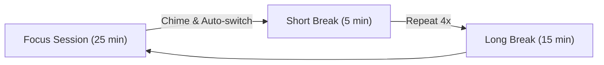

# Pomodoro Focus Timer

The **Pomodoro Timer** in Jotter provides a floating, distraction-free focus bar designed to help you maintain deep work rhythm across your tasks without context switching.

---

## Overview

The Pomodoro technique alternates focused work sprints with brief restorative breaks:

---

## Key Features

### 1. Floating Docked Toolbar
* **Toggle Anywhere**: Click the 🍅 tomato icon in the top navigation bar to summon or minimize the floating Pomodoro bar.
* **Persistent Timer**: The timer runs seamlessly in the background as you switch between Kanban, List, Matrix, Triage, and Time views.
* **Tab Badge**: Your browser tab automatically displays the remaining countdown (e.g. `(24:15) 🍅 Jotter`).

### 2. Task Focus Binding
* **1-Click Focus**: Hover over any task card and click the timer button to bind the Pomodoro bar to that task.
* **Visual Focus Indicator**: The active task card displays a subtle pulsing 🍅 badge.
* **Detach Anytime**: Click the <kbd>×</kbd> button on the Pomodoro bar to unbind the task without losing your timer progress.

### 3. Audio Chime & Notifications
* **Synthesized Gentle Chime**: Built-in harmonic Web Audio chime notifies you when each focus or break phase completes—100% offline with zero external audio assets.
* **Configurable**: Easily toggle sound on or off in the timer settings popover.

### 4. Custom Durations
Click the ⚙️ settings icon on the Pomodoro bar to configure:
* **Focus Duration**: Default 25 minutes (1–120 min).
* **Short Break**: Default 5 minutes (1–60 min).
* **Long Break**: Default 15 minutes (1–90 min).
* **Audio Notifications**: Sound toggle.

### 5. Keyboard Shortcuts
* <kbd>Space</kbd>: Start / Pause the active timer.
* <kbd>Esc</kbd>: Close the settings popover / minimize bar.
