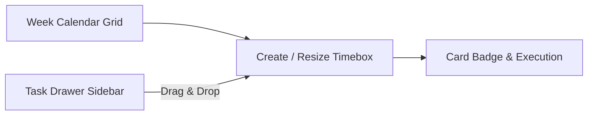

# Time Boxing View

The **Time Boxing** feature provides an interactive, week-calendar interface designed to help you structure focus periods and intentionally schedule tasks without context switching or calendar overload.

---

## Overview

Time Boxing separates **time containers (boxes)** from **tasks**:
* A **Timebox** is an intentional block of focused time (e.g. *09:00–11:30 Deep Work*, *14:00–15:00 Sprint Code Reviews*).
* **Tasks** are slotted into these boxes via simple drag-and-drop.
* Tasks are not forced into rigid durations — you can batch multiple small tasks into a single timebox or allocate an entire block to one deep focus task.

---

## Key Features

### 1. Interactive Week Schedule
* **Work Week vs Full Week**: Toggle effortlessly between 5-day view (<kbd>Mon–Fri</kbd>) and 7-day view (<kbd>Mon–Sun</kbd>).
* **Configurable Hours**: Default work hours (`08:00 – 18:00`) can be customized in **Settings**.
* **Current Time Indicator**: A live red line tracks the current time of day.

### 2. Creating and Editing Timeboxes
* **Slot Click**: Click any empty hour slot on the grid to create a timebox pre-filled with that day and hour.
* **Toolbar Button**: Use the **New Timebox** button in the top navigation toolbar.
* **Color Coding**: Choose from curated color accents (Indigo, Blue, Emerald, Amber, Rose, Purple, Teal, Slate).

### 3. Task Allocation (Drag & Drop)
* Open the **Unallocated Tasks Drawer** on the right side of the screen.
* Filter available tasks by active project, "Planned for Today", or search query.
* Drag any task card directly onto a calendar timebox to allocate it.
* Tasks can be removed from a timebox at any time by clicking the <kbd>×</kbd> icon.

### 4. Visual Task Card Badges
* When a task is allocated to a timebox, its Kanban card on the main board displays a badge:
  `[📦 Mon 09:00 Deep Work]`.
* Completed/Done tasks within a timebox automatically display a checkmark and strikethrough styling.

---

## Configuration & Settings

Under **Settings → Time Boxing**, you can customize:
* **Default Week View**: Work Week (5 days) vs Full Week (7 days).
* **Calendar Start Hour**: Earliest visible hour on the grid (e.g. `7` or `8`).
* **Calendar End Hour**: Latest visible hour on the grid (e.g. `18` or `20`).
