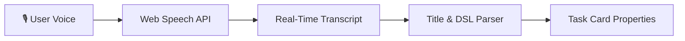

# Voice Dictation (Speech-to-Text)

Jotter supports native voice dictation for rapid hands-free task capture and notes editing. Powered by the browser's native **Web Speech API**, voice dictation works directly on your device with zero cloud latency and no external service dependencies.

---

## How It Works

When dictating task titles or descriptions, speech is transcribed in real-time. Because Jotter includes a live natural language parser, any spoken metadata (dates, priority tokens, tags, buckets) is automatically detected and parsed into task properties.

---

## Dictating Task Titles

1. Open the **Task Creation Modal** (<kbd>q</kbd>) or click the title in the **Task Detail Modal**.
2. Click the **Microphone icon** on the right side of the title input, or press <kbd>Alt</kbd> + <kbd>D</kbd>.
3. Speak your task title and properties naturally.

### Natural Language Synergy Examples

| Spoken Text | Extracted Title | Extracted Metadata |
| :--- | :--- | :--- |
| *"Refactor authentication endpoint !urgent #backend @tomorrow"* | `Refactor authentication endpoint` | Priority: `urgent` Tag: `backend` Due Date: Tomorrow |
| *"Weekly team sync in:todo #meeting @friday"* | `Weekly team sync` | Column: `todo` Tag: `meeting` Due Date: Friday |
| *"Fix memory leak !high #bug"* | `Fix memory leak` | Priority: `high` Tag: `bug` |

> [!TIP]
> You can click or press <kbd>Alt</kbd> + <kbd>D</kbd> again at any point to stop recording.

---

## Dictating Notes & Checklists

In the **Task Detail Modal** and **Task Create Modal**, the Markdown editor features a dedicated dictation button in the top-right toolbar:

1. Click the **Microphone icon** in the top-right corner of the editor.
2. Dictate your thoughts, bullet points, or checklist items.
3. The transcribed text is automatically formatted and inserted at the end of the markdown note.

---

## Browser Support & Permissions

Voice dictation relies on native browser capabilities:

* **Supported Browsers**: Google Chrome, Microsoft Edge, Brave, Safari, and Chromium-based mobile browsers.
* **Permissions**: The browser will ask for microphone permissions on first use. If denied, ensure microphone access is enabled in your browser's site settings.
* **Language Support**: Dictation automatically respects your active language setting in Jotter (switching between English `en-US` and German `de-DE`).

---

## Keyboard Shortcuts

| Shortcut | Action | Description |
| :--- | :--- | :--- |
| <kbd>Alt</kbd> + <kbd>D</kbd> | **Toggle Dictation** | Starts or stops voice recording when focused inside the task title input. |
